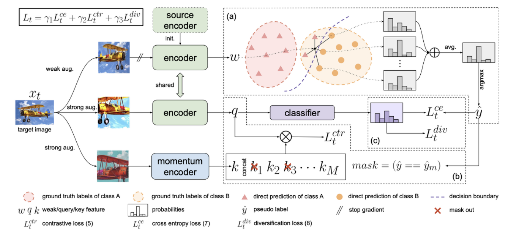
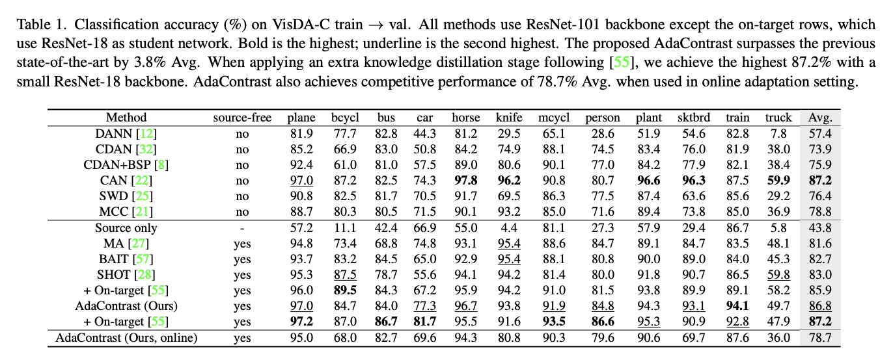
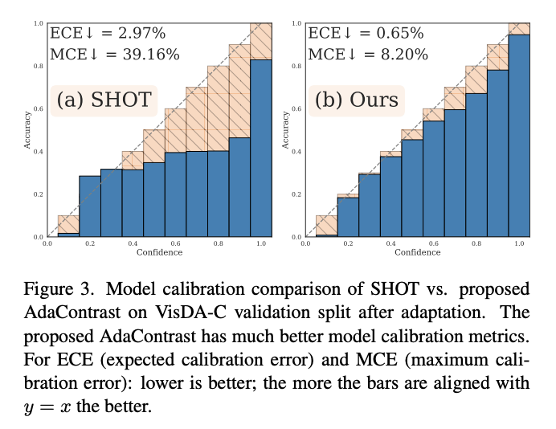

## Introduction
Conventional deep networks have performed well when the training and testing data share a similar distribution. However, they often malfunction when faced with sudden arrivals of unseen data, as encountered in real-world scenarios. This challenge is referred to as domain shift. The field of Domain Adaptation has extensively addressed this issue through various research efforts. Recently, there has been active research in the field of Test-Time Adaptation (TTA). The fundamental problem setting assumes that access is available to the source model, but due to reasons such as data privacy, the source data is not available.

The major challenges addressed in this paper regarding Test-Time Adaptation (TTA) are as follows:
- How can we learn the representation of the target domain without label information for the target domain?
- Is it possible to create a classifier for the target domain solely based on the classifier from the source domain?
To overcome these difficulties, the proposed method introduces two key factors:

- Self-Supervised Contrastive Learning
- Online Pseudo Labeling
Training these two factors above online has set the State of the Art (SOTA) in TTA tasks.

> The entropy minimization does not model the relation among different samples.
More importantly, distrupts the model calibration on target data due to direct entropy optimization.
> The pseudo labels are updated only a per-epoch basis, which fails to reflect the most recent model improvment during an epoch.

## Method

**Online Pseudo Label Refinement (Figure a)**

To refine pseudo labels online, we propose reflecting pseudo labels at the batch level rather than the epoch level. How is the refinement done? The target encoder is initiated with a model trained on source data. Given a target image, we pass it through the target encoder via weak augmentation to create feature vectors. Then, in the target feature space, we vote for the nearest neighbor by comparing with the original target image. The selected feature vectors and the weak feature (w) of the original target image are fed into the classifier to compute the average probability. The final pseudo label is obtained through the argmax operation.

Memory Queue

To perform nearest neighbor search as discussed above, features and probabilities of weakly augmented target samples are stored in a memory queue with a length of M. Initially, it is managed with random target samples. To stabilize the feature space, a gradually changing momentum model is utilized for computing features and probabilities. Nearest-neighbor soft voting involves calculating the cosine distance between the features stored in the memory queue and the weak feature (w). Based on this value, the nearest neighbor is selected, and the pseudo label is generated through an argmax operation.

**Joint Self-Supervised Contrastive Learning (Figures b, c)**

Inspired by the ideas of conventional self-supervised contrastive learning, we extract pairwise information from target data. The fundamental principles shared with the existing approach include:

- Positive pairs: Features of different views of the same image
- Negative pairs: Features of different images
In essence, positive pairs are trained to attract each other, while negative pairs are trained to move apart.

Encoder Initialization by Source

The momentum encoder of the proposed method is initialized with source weights. Additionally, the momentum encoder is used to update the memory queue. Thus, the momentum encoder plays a role in (a) updating the memory queue for target features and probabilities and (b) creating contrastive features.

Exclusion of Same-Class Negative Pairs

Two versions of target images created with strong augmentation are encoded as query and key features. Among them, key features are updated in the memory queue (corresponding to Figure b) (Note: This memory queue is separate from the one storing weak augmented targets). The proposed method utilizes the InfoNCE Loss used in MoCo to define positives and negatives for training. Positives represent the similarity between query and key features, and negatives represent the similarity between query and memory queue features. Following the concept of traditional contrastive learning, the similarity of positive pairs is trained to decrease, and the similarity of negative pairs is trained to increase. It's crucial to exclude same-class negative pairs from the negative set. The following formula encapsulates the explanation above.

 $$L_{t}^{ctr}=L_{infoNCE}=-log\frac{exp q \cdot k_{+} / \tau }{\sum_{j \in N_{q}}q \cdot k_{j} / \tau}$$
 $$N_{q}=\{j|1\leq j\leq P, j \in Z, \hat{y} \neq \hat{y}^{j}\}\cup \{0\}$$

Additional Regularization

- Weak-Strong Consistency
Since ground truth for the test is not provided in TTA, we supervise predictions for strongly-augmented target images using pseudo labels obtained from weakly-augmented target images through cross-entropy. This process effectively learns the consistency between predictions from weak and strong augmentations. In this paper, the advantage is highlighted as no confidence thresholding is performed when using refined pseudo labels under the condition of having ground truth.

$$L_{t}^{ce}=-\mathbb{E}_{x_{t} \in \mathcal{X}_{t}} \sum_{c=1}^{C}\hat{y}^{c} log p_{q}^{c}$$

- Diversity Regularization
While the process of creating pseudo labels described above can reduce noises, it is not ideal. Therefore, the proposed method introduces a regularization term to address this issue. To promote class diversification, the model is trained with a class diversification loss.

$$L_{t}^{div}=-\mathbb{E}_{x_{t} \in \mathcal{X}_{t}} \sum_{c=1}^{C} \bar{p}_{q}^{c} log \bar{p}_{q}^{c}$$
$$\bar{p}_{q}=\mathbb{E}_{{x}_{t} \in \mathcal{X}_{t}} \sigma (g_{t}(t_{s}(x_{t})))$$

In the end, the model is trained for the target domain using the three aforementioned losses.

## Experiment Results

- Dataset: Visda-C, DomainNet-126
- Task: Classification
- Metric: Accuracy

The table above presents class-wise accuracy for Visda-C. Not only does it achieve State of the Art (SoTA), but it is noteworthy that online test-time adaptation is possible (last row of the table). The difference between online and offline here refers to the number of training epochs for the target domain. Online training involves only 1 epoch, meaning learning during the inference phase. In contrast, offline training continues for multiple epochs on the target domain.

## Analysis

The above results depict the analysis of model calibration. I believe that model calibration in test-time adaptation enhances the reliability, robustness, and interpretability of the adapted target model, making it a crucial aspect of deploying machine learning solutions in dynamic environments.

It can be observed that the model calibration is well-executed compared to previous shot papers. ECE and MCE scores serve as quantitative indicators for expressing model calibration, where smaller values indicate better model calibration.

## Reference

- Chen, Dian, et al. "Contrastive test-time adaptation." Proceedings of the IEEE/CVF Conference on Computer Vision and Pattern Recognition. 2022.
- He, Kaiming, et al. "Momentum contrast for unsupervised visual representation learning." Proceedings of the IEEE/CVF conference on computer vision and pattern recognition. 2020.

