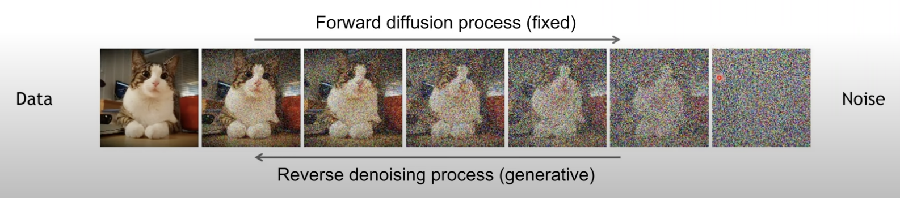
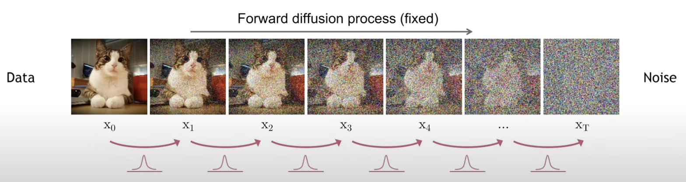
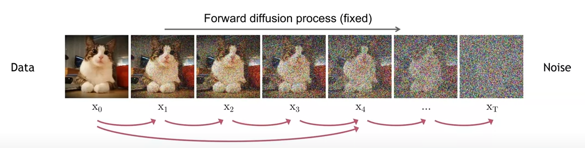
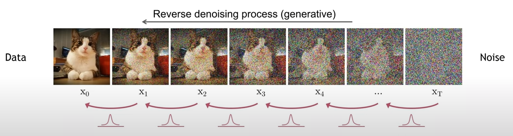
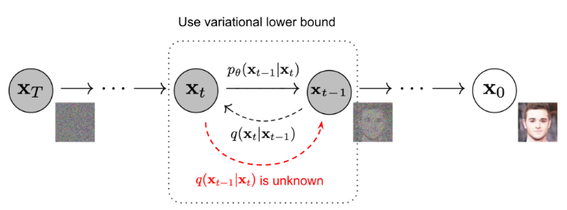

### Physical Intuition
Diffusion is the phenomenon where ink spreads when added to water, as shown in the diagram below. Over time, the ink eventually becomes evenly distributed and uniform. It is difficult to determine the density of the ink when it was initially added. What if we could restore the uniform ink to its initial state again? Let's try to solve this using deep learning!!

If we view ink at the molecular level, observing it in small sequence units, shifting occurs within a Gaussian distribution.

### Diffusion 

Diffusion consists of forward and reverse processes, as illustrated in the diagram below. 
The forward process involves adding noise to the original image, while the reverse process involves generating the original image from the noise.

### Forward Diffusion Process

The forward process, as depicted in the diagram below, involves gradually adding Gaussian noise from the original image $\mathbf{x}_ {0}$ through multiple time steps until reaching $\mathbf{x}_ {T}$. As the step $t$ increases, the original image $\mathbf{x}_ {0}$ gradually loses discernible features. Eventually, as $T \to \infty$, $\mathbf{x}_ {T}$ becomes identical to an isotropic Gaussian distribution.

In the above process, each step can be expressed by the following equation, where the step size is adjusted by the variance schedule ${\beta_{t}\in(0,1)}$:
$$ q(\mathbf{x}_ {t}|\mathbf{x}_ {t-1}) = \mathcal{N}(\mathbf{x}_ {t};\sqrt{1-\beta_{t}}\mathbf{x}_ {t-1}, \beta_{t} \text{I})$$
Generally, since $\beta$ tends to have small values close to 0, interpreting the equation above suggests defining the forward process by decreasing the value of the previous step while adding $\beta$ noise.

전체 과정은 다음과 같이 아래의 joint distribution으로 표현될 수 있습니다. 주어진 이미지 $\mathbf{x}_ {0}$에 노이즈를 조금씩 추가하여 $\mathbf{x}_ {1}$에서 $\mathbf{x}_ {T}$까지의 과정을 나타냅니다.
$$ q(\mathbf{x}_ {1:T}|\mathbf{x}_ {0}) = \prod_{t=1}^{T}q(\mathbf{x}_ {t}|\mathbf{x}_ {t-1})$$

In the DDPM paper, the Gaussian kernels at each time step are continuous, allowing the definition of an image generated at any time step $t$ as follows.

Using the reparameterization trick, we can sample any $\mathbf{x}_ {t}$ as follows. 
Here, let $\alpha=1-\beta_{t}$ and $\bar{\alpha_{t}} = \prod_{i=1}^{t} \alpha_{i}$, then $\mathbf{x}_ {t}$ can be derived as follows.
$$
\begin{align}
\mathbf{x}_ {t} &=\sqrt{\alpha_{t}}\mathbf{x}_ {t-1}+\sqrt{1-\alpha_{t}}\epsilon_{t-1} \\\\\
& = \sqrt{\alpha_{t}}(\sqrt{\alpha_{t-1}}\mathbf{x}_ {t-2}+\sqrt{1-\alpha_{t-1}}\epsilon_{t-2})+\sqrt{1-\alpha_{t}}\epsilon_{t-1} \\\\\
& = \sqrt{\alpha_{t}\alpha_{t-1}}\mathbf{x}_ {t-2}+\sqrt{\alpha_{t}(1-\alpha_{t-1})}\epsilon_{t-2}+\sqrt{1-\alpha_{t}}\epsilon_{t-1} \\\\\
& = \sqrt{\alpha_{t}\alpha_{t-1}}\mathbf{x}_ {t-2}+\sqrt{1-\alpha_{t}\alpha_{t-1}}\epsilon_{t-2} \\\\\
& = \sqrt{\bar{\alpha_{t}}}\mathbf{x}_ {0} + \sqrt{1-\bar{\alpha_{t}}}\epsilon
\end{align}
$$
In the third equation, we expanded the expression into the fourth equation by utilizing the fact that combining two Gaussian distributions with different variances, $\mathcal{N}(0, \sigma_{1}^2)$ and $\mathcal{N}(0, \sigma_{2}^2)$, results in a single distribution represented by $\mathcal{N}(0, (\sigma_{1}^2+\sigma_{2}^2)\text{I})$.

Therefore, $q(\mathbf{x}_ {t}|\mathbf{x}_ {0})$ can be represented by a Gaussian distribution with mean $\sqrt{\bar{\alpha}}\mathbf{x}_ {0}$ and variance $(1-\bar{\alpha})$.
$$ q(\mathbf{x}_ {t}|\mathbf{x}_ {0}) = \mathcal{N}(\mathbf{x}_ {t};\sqrt{\bar{\alpha}}\mathbf{x}_ {0}, (1-\bar{\alpha})\text{I})$$
$$\text{For sampling:} \ \mathbf{x}_ {t}=\bar{\alpha}\mathbf{x}_ {0}+\sqrt{1-\bar{\alpha}}\epsilon$$
$$ \text{where} \ \epsilon \sim \mathcal{N}(0, \text{I})$$

### Reverse Diffusion Process

As mentioned earlier, the phenomenon of Diffusion has a physical intuition that the Reverse Process follows a Gaussian distribution within small sequences just like the Forward Process. Therefore, we can assume that the reverse process also follows a Gaussian distribution. Consequently, we can model these Gaussians through deep learning.

Directly estimating $q(\mathbf{x}_ {t-1}|\mathbf{x}_ {t})$ is practically very challenging as it requires having access to the entire dataset. Instead, we train our deep learning model $p_{\theta}$ to approximate the preceding conditional probability $q(\mathbf{x}_ {t-1}|\mathbf{x}_ {t})$.
In particular, given $\mathbf{x}_ {0}$, we can estimate the inverse conditional probability $q(\mathbf{x}_ {t-1}|\mathbf{x}_ {t})$ as follows.
$$q(\mathbf{x}_ {t-1}|\mathbf{x}_ {t}, \mathbf{x}_ {0}) = \mathcal{N}(\mathbf{x}_ {t-1}; \tilde{\mu}(\mathbf{x}_ {t}, \mathbf{x}_ {0}),\tilde{\beta}\text{I} )$$

And the overall reverse process is as follows.

$$ 
\begin{align}
p_{\theta}(\mathbf{x}_ {0:T})=p(\mathbf{x}_ {T})\prod_{t=1}^Tp_{\theta}(\mathbf{x}_ {t-1}|\mathbf{x}_ {t}) \\\\\
p_{\theta}(\mathbf{x}_ {t-1}|\mathbf{x}_ {t})=\mathcal{N}(\mathbf{x}_ {t-1};\mu_{\theta}(\mathbf{x}_ {t},t), \sum_{\theta}(\mathbf{x}_t,t))
\end{align}
$$

In other words, the network learns a Gaussian distribution with the aforementioned mean and variance.

Applying Bayes' rule allows us to derive $q(\mathbf{x}_ {t-1}|\mathbf{x}_ {t})$ as follows.

$$
q(\mathbf{x}_ {t-1}|\mathbf{x}_ {t},\mathbf{x}_ {0}) = q(\mathbf{x}_ {t}|\mathbf{x}_ {t-1},\mathbf{x}_ {0})\frac{q(\mathbf{x}_ {t-1}|\mathbf{x}_ {0})}{q(\mathbf{x}_ {t}|\mathbf{x}_ {0})}
$$
$$
\propto\exp(-\frac{1}{2}(\frac{(\mathbf{x}_ {t}-\sqrt{\alpha_ {t}}\mathbf{x}_ {t-1})^{2}}{\beta_ {t}}+\frac{(\mathbf{x}_ {t-1}-\sqrt{\bar{\alpha}_ {t-1}}\mathbf{x}_ {0})^{2}}{1-\bar{\alpha}_ {t-1}} -\frac{(\mathbf{x}_ {t}-\sqrt{\bar{\alpha}_ {t}}\mathbf{x}_ {0})^{2}}{1-\bar{\alpha}_ {t}}))
$$
$$
= \exp(-\frac{1}{2}(\frac{\mathbf{x}_ {t}^2-2\sqrt{\alpha_ {t}}\mathbf{x}_ {t}\mathbf{x}_ {t-1}+\alpha_ {t}\mathbf{x}_ {t-1}^2}{\beta_ {t}}+ \frac{\mathbf{x}_ {t-1}^2-2\sqrt{\bar\alpha_ {t-1}}\mathbf{x}_ {0}\mathbf{x}_ {t-1}+\bar\alpha_ {t-1}\mathbf{x}_ {0}^2}{1-\bar\alpha_ {t-1}}-\frac{(\mathbf{x}_ {t}-\sqrt{\bar{\alpha}_ {t}}\mathbf{x}_ {0})^{2}}{1-\bar{\alpha}_ {t}}))
$$
$$
= \exp(-\frac{1}{2}((\frac{\alpha_ {t}}{\beta_{t}}+\frac{1}{1-\bar\alpha_ {t-1}})\mathbf{x}_ {t-1}^2-(\frac{2\sqrt{\alpha_ {t}}}{\beta_ {t}}\mathbf{x}_ {t}+\frac{2\sqrt{\bar\alpha_ {t-1}}}{1-\bar\alpha_ {t-1}}\mathbf{x}_ {0})\mathbf{x}_ {t-1} +C(\mathbf{x}_ {t},\mathbf{x}_ {0})))
$$

Here, $C(\mathbf{x}_ {t},\mathbf{x}_ {0})$ is a function that does not include $\mathbf{x}_ {t-1}$. According to the standard Gaussian density function, the mean and variance are parameterized as follows.

$$\tilde{\beta}=1/(\frac{\alpha_{t}}{\beta_{t}}+\frac{1}{1-\bar\alpha_{t-1}})=\frac{1-\bar\alpha_{t-1}}{1-\bar\alpha_{t}}\cdot\beta_{t}
$$

$$
\begin{align}
\tilde{\mu}(\mathbf{x}_ {t}, \mathbf{x}_ {0})&=(\frac{\sqrt{\alpha_{t}}}{\beta_{t}}\mathbf{x}_ {t}+\frac{\sqrt{\bar\alpha_{t-1}}}{1-\bar\alpha_{t-1}}\mathbf{x}_ {0})\frac{1-\bar\alpha_{t-1}}{1-\bar\alpha_{t}}\cdot\beta_{t} \\\\\
&= \frac{\sqrt{\alpha_{t}}(1-\bar\alpha_{t-1})}{(1-\bar\alpha_{t})}\mathbf{x}_ {t}+\frac{\sqrt{\bar\alpha_{t-1}}\beta_{t}}{1-\bar\alpha_{t}}\mathbf{x}_ {0} \\\\\
&= \frac{\sqrt{\alpha_{t}}(1-\bar\alpha_{t-1})}{(1-\bar\alpha_{t})}\mathbf{x}_ {t}+\frac{\sqrt{\bar\alpha_{t-1}}\beta_{t}}{1-\bar\alpha_{t}}\frac{1}{\sqrt{\bar\alpha_{t}}}(\mathbf{x}_ {t}-\sqrt{1-\bar\alpha_{t}}\epsilon_{t}) \\\\\
&= \frac{1}{\sqrt{\alpha_{t}}}(\mathbf{x}_ {t}-\frac{1-\alpha_{t}}{\sqrt{1-\bar\alpha_{t}}}\epsilon_{t})
\end{align}
$$

As illustrated below, this setup is similar to a VAE, so we optimize the negative log-likelihood using the variational lower bound. 

$$
-\text{log}p_ {\theta}(\mathbf{x}_ {0}) \leq -\text{log}p_{\theta}(\mathbf{x}_ {0}) + D_{KL}(q(\mathbf{x}_ {1:T}|\mathbf{x}_ {0})||p_{\theta}(\mathbf{x}_ {1:T}|\mathbf{x}_ {0}))
$$
$$
= -\text{log}p_{\theta}(\mathbf{x}_ {0}) + \mathbb{E}_ {\mathbf{x}_ {1:T} \sim q(\mathbf{x}_ {1:T}|\mathbf{x}_ {0})}\left [\text{log}\frac{q(\mathbf{x}_ {1:T}|\mathbf{x}_ {0})}{p_ {\theta}(\mathbf{x}_ {0:T})/p_{\theta}(\mathbf{x}_ {0})}  \right ]
$$
$$
= -\text{log}p_ {\theta}(\mathbf{x}_ {0}) + \mathbb{E}_ {q}\left [\text{log}\frac{q(\mathbf{x}_ {1:T}|\mathbf{x}_ {0})}{p_ {\theta}(\mathbf{x}_ {0:T})}+\text{log}p_ {\theta}(\mathbf{x}_ {0})  \right ]
$$
$$
= \mathbb{E}_ {q}\left [\text{log}\frac{q(\mathbf{x}_ {1:T}|\mathbf{x}_ {0})}{p_ {\theta}(\mathbf{x}_ {0:T})}\right ]
$$
$$
\text{Let} \ L_{VLB} = \mathbb{E}_ {q(\mathbf{x}_ {0:T})}\left [\text{log}\frac{q(\mathbf{x}_ {1:T}|\mathbf{x}_ {0})}{p_{\theta}(\mathbf{x}_ {0:T})}\right ] \geq \mathbb{E}_ {q(\mathbf{x}_ {0})}\text{log}p_ {\theta}(\mathbf{x}_ {0})
$$

The $L_{VLB}$ can be expanded into KL-divergence and entropy terms as follows.
$$
L_ {VLB} = \mathbb{E}_ {q(\mathbf{x}_ {0:T})}\left [\text{log}\frac{q(\mathbf{x}_ {1:T}|\mathbf{x}_ {0})}{p_{\theta}(\mathbf{x}_ {0:T})}\right ] 
$$
$$
= \mathbb{E}_ q \left [\text{log}\frac{\prod_ {t=1}^Tq(\mathbf{x}_ {t}|\mathbf{x}_ {t-1})}{p_{\theta}(\mathbf{x}_ {T})\prod_{t=1}^{T}p_{\theta}(\mathbf{x}_ {t-1}|\mathbf{x}_ {t})}  \right ]
$$
$$
= \mathbb{E}_ q\left [-\text{log}p_ {\theta}(\mathbf{x}_ {T})+\prod_ {t=1}^T\text{log}\frac{q(\mathbf{x}_ {t}|\mathbf{x}_ {t-1})}{p_{\theta}(\mathbf{x}_ {t-1}|\mathbf{x}_ {t})} \right ]
$$
$$
= \mathbb{E}_ q\left [-\text{log}p_ {\theta}(\mathbf{x}_ {T})+\prod_ {t=2}^T\text{log}\frac{q(\mathbf{x}_ {t}|\mathbf{x}_ {t-1})}{p_{\theta}(\mathbf{x}_ {t-1}|\mathbf{x}_ {t})}+\text{log}\frac{q(\mathbf{x}_ {1}|\mathbf{x}_ {0})}{p_ {\theta}(\mathbf{x}_ {0}|\mathbf{x}_ {1})} \right ]
$$
$$
= \mathbb{E}_ q\left [-\text{log}p_ {\theta}(\mathbf{x}_ {T})+\prod_ {t=2}^T\text{log}(\frac{q(\mathbf{x}_ {t-1}|\mathbf{x}_ {t}, \mathbf{x}_ {0})}{p_ {\theta}(\mathbf{x}_ {t-1}|\mathbf{x}_ {t})} \cdot \frac{q(\mathbf{x}_ {t}|\mathbf{x}_ {0})}{q(\mathbf{x}_ {t-1}|\mathbf{x}_ {0})})+ \text{log}\frac{q(\mathbf{x}_ {1}|\mathbf{x}_ {0})}{p_ {\theta}(\mathbf{x}_ {0}|\mathbf{x}_ {1})} \right ]
$$
$$
= \mathbb{E}_ q\left [-\text{log}p_ {\theta}(\mathbf{x}_ {T})+\prod_ {t=2}^T\text{log}\frac{q(\mathbf{x}_ {t-1}|\mathbf{x}_ {t}, \mathbf{x}_ {0})}{p_ {\theta}(\mathbf{x}_ {t-1}|\mathbf{x}_ {t})}  + \prod_ {t=2}^T\text{log}\frac{q(\mathbf{x}_ {t}|\mathbf{x}_ {0})}{q(\mathbf{x}_ {t-1}|\mathbf{x}_ {0})}+\text{log}\frac{q(\mathbf{x}_ {1}|\mathbf{x}_ {0})}{p_ {\theta}(\mathbf{x}_ {0}|\mathbf{x}_ {1})} \right ]
$$
$$
= \mathbb{E}_ q\left [-\text{log}p_ {\theta}(\mathbf{x}_ {T})+\prod_ {t=2}^T\text{log}\frac{q(\mathbf{x}_ {t-1}|\mathbf{x}_ {t}, \mathbf{x}_ {0})}{p_ {\theta}(\mathbf{x}_ {t-1}|\mathbf{x}_ {t})}  + \text{log}\frac{q(\mathbf{x}_ {T}|\mathbf{x}_ {0})}{q(\mathbf{x}_ {1}|\mathbf{x}_ {0})}+\text{log}\frac{q(\mathbf{x}_ {1}|\mathbf{x}_ {0})}{p_ {\theta}(\mathbf{x}_ {0}|\mathbf{x}_ {1})} \right ]
$$
$$
= \mathbb{E}_ {q}\left [-\text{log}\frac{q(\mathbf{x}_ {T}|\mathbf{x}_ {0})}{p_ {\theta}(\mathbf{x}_ {T})} + \prod_ {t=2}^T\text{log}\frac{q(\mathbf{x}_ {t-1}|\mathbf{x}_ {t}, \mathbf{x}_ {0})}{p_ {\theta}(\mathbf{x}_ {t-1}|\mathbf{x}_ {t})}-\text{log}p_ {\theta}(\mathbf{x}_ {0}|\mathbf{x}_ {1})\right ]
$$
$$
= \mathbb{E}_ {q}\left [D_ {KL}(q(\mathbf{x}_ {T}|\mathbf{x}_ {0}) || p_ {\theta}(\mathbf{x}_ {T})) + \prod_ {t=2}^TD_ {KL}(q(\mathbf{x}_ {t-1}|\mathbf{x}_ {t}, \mathbf{x}_ {0}) || p_ {\theta}(\mathbf{x}_ {t-1}|\mathbf{x}_ {t}))-\text{log}p_ {\theta}(\mathbf{x}_ {0}|\mathbf{x}_ {1})\right ]
$$

From the above equation, $L_{\text{VLB}}$ can be decomposed as follows.

$$
L_ {VLB}=L_ {T}+L_ {T-1}+\cdot\cdot\cdot+L_ {0}
$$
$$
\text{where} \ L_ {T}=D_ {KL}(q(\mathbf{x}_ {T}|\mathbf{x}_ {0}) || p_{\theta}(\mathbf{x}_ {T})) 
$$
$$
L_ {t}=D_ {KL}(q(\mathbf{x}_ {t}|\mathbf{x}_ {t+1}, \mathbf{x}_ {0}) || p_{\theta}(\mathbf{x}_ {t}|\mathbf{x}_ {t+1})) \ \text{for} \ 1 \le t \le T-1 
$$
$$
L_ {0}=-\text{log}p_ {\theta}(\mathbf{x}_ {0}|\mathbf{x}_ {1})
$$

$L_{T}$ and $L_{t}$ become terms comparing two Gaussian distributions. Specifically, $L_{T}$ is noted to have a constant value since $q$ has no learnable parameters and $\mathbf{x}_ {T}$ is Gaussian noise.

### Parameters for Learning $L_{t}$!
As mentioned earlier, in the reverse process, the neural network $p_ {\theta}(\mathbf{x}_ {t-1}|\mathbf{x}_ {t}) = \mathcal{N}(\mathbf{x}_ {t-1};\mu_ {\theta}(\mathbf{x}_ {t},t), \Sigma_ {\theta}(\mathbf{x}_ t,t))$ is trained to approximate the conditional probability $q(\mathbf{x}_ {t-1}|\mathbf{x}_ {t})$. In that case, we train the mean $\mu_ {\theta}$ of $p_ {\theta}(\mathbf{x}_ {t-1}|\mathbf{x}_ {t})$ to predict the mean $\tilde{\mu}=\frac{1}{\sqrt{\alpha_ {t}}}(\mathbf{x}_ {t}-\frac{1-\alpha_{t}}{\sqrt{1-\bar\alpha_ {t}}}\epsilon_ {t})$ of $q(\mathbf{x}_ {t-1}|\mathbf{x}_ {t})$. During training, since we can sample $\mathbf{x}_ {t}$, we can replace the problem of predicting $\epsilon_ {t}$ from $\mathbf{x}_ {t}$ at time step $t$ by reparameterizing the Gaussian noise term.
$$
\begin{align}
\mu_{\theta}(\mathbf{x}_ {t},t)&=\frac{1}{\sqrt{\alpha_{t}}}(\mathbf{x}_ {t}-\frac{1-\alpha_{t}}{\sqrt{1-\bar\alpha_{t}}}\epsilon_{\theta}(\mathbf{x}_ {t},t)) \\\\\
\text{Thus} \ \mathbf{x}_ {t-1}&=\mathcal{N}(\mathbf{x}_ {t-1};\frac{1}{\sqrt{\alpha_{t}}}(\mathbf{x}_ {t}-\frac{1-\alpha_{t}}{\sqrt{1-\bar\alpha_{t}}}\epsilon_{t}(\mathbf{x}_ {t},t)), \sum_{\theta}(\mathbf{x}_t,t))
\end{align}
$$

$L_{t}$ is trained to minimize the difference with $\tilde{\mu}$.

$$
L_{t}=\mathbb{E}_ {\mathbf{x}_ {0},\epsilon}\left [\frac{1}{2\left\|\sum_ {\theta}(\mathbf{x}_ {t},t) \right\|_ {2}^{2}}\left\| \tilde{\mu}(\mathbf{x}_ {t},t)-\mu_ {\theta}(\mathbf{x}_ {t},t)\right\|^{2}  \right ]
$$
$$
=\mathbb{E}_ {\mathbf{x}_ {0},\epsilon}\left [\frac{1}{2\left\|\sum_ {\theta} \right\|_ {2}^{2}}\left\|\frac{1}{\sqrt{\alpha_ {t}}}(\mathbf{x}_ {t}-\frac{1-\alpha_ {t}}{\sqrt{1-\bar\alpha_ {t}}}\epsilon_ {t})- \frac{1}{\sqrt{\alpha_ {t}}}(\mathbf{x}_ {t}-\frac{1-\alpha_ {t}}{\sqrt{1-\bar\alpha_ {t}}}\epsilon_ {\theta}(\mathbf{x}_ {t},t))\right\|^{2}\right ] 
$$
$$
=\mathbb{E}_ {\mathbf{x}_ {0},\epsilon}\left [\frac{(1-\alpha_ {t})^{2}}{2\alpha_ {t}(1-\bar{\alpha}_ {t})\left\|\sum_ {\theta} \right\|_ {2}^{2}}\left\|\epsilon_ {t}-\epsilon_ {\theta}(\mathbf{x}_ {t},t)\right\|^{2}\right ]
$$
$$
=\mathbb{E}_ {\mathbf{x}_ {0},\epsilon}\left [\frac{(1-\alpha_ {t})^{2}}{2\alpha_ {t}(1-\bar{\alpha}_ {t})\left\|\sum_ {\theta} \right\|_ {2}^{2}}\left\|\epsilon_ {t}-\epsilon_ {\theta}(\sqrt{\bar{\alpha_ {t}}}\mathbf{x}_ {0} + \sqrt{1-\bar{\alpha_ {t}}}\epsilon_ {t},t)\right\|^{2}\right ]
$$

From the results of experiments in DDPM, it can be simplified to the following equation by ignoring the weighting term in the front part of the equation, as the diffusion model performs better.
$$
L_{t}^{simple}=\mathbb{E}_ {t \sim [1,T],\mathbf{x}_  {0},\epsilon_ {t}}\left [\left\|\epsilon_ {t}-\epsilon_ {\theta}(\mathbf{x}_ {t},t) \right\|^{2}  \right ]
$$
$$
=\mathbb{E}_ {t \sim [1,T],\mathbf{x}_ {0},\epsilon_{t}}\left [\left\|\epsilon_ {t}-\epsilon_ {\theta}(\sqrt{\bar{\alpha_ {t}}}\mathbf{x}_ {0} + \sqrt{1-\bar{\alpha_ {t}}}\epsilon_ {t},t) \right\|^{2}  \right ]
$$

