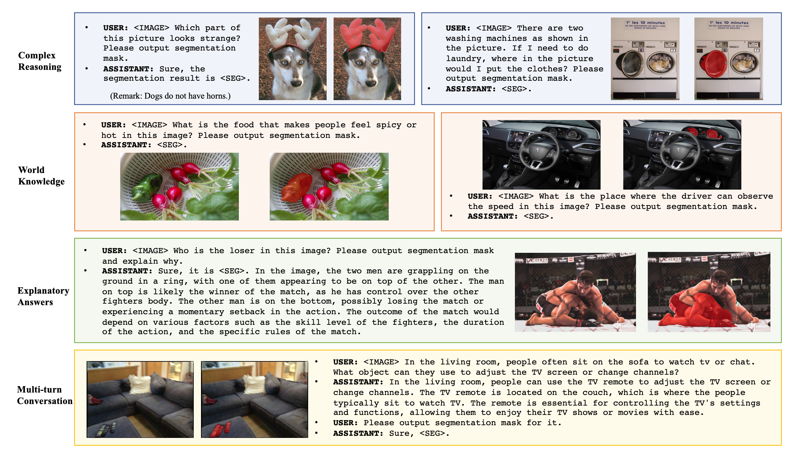
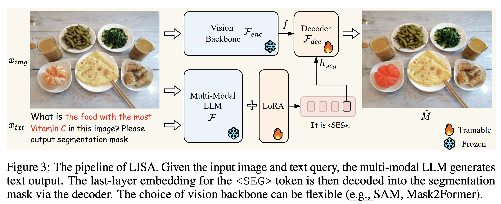
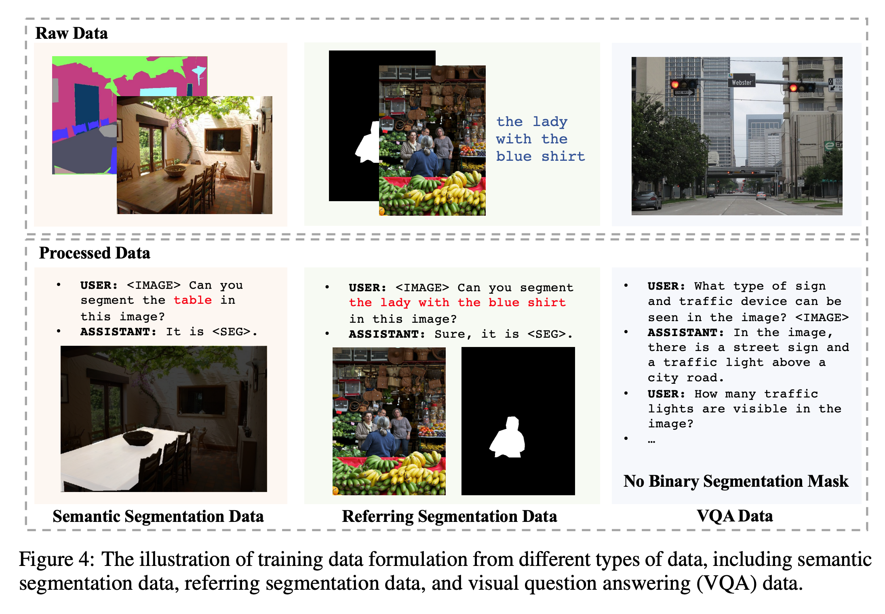

## Introduction
In everyday situations, users tend to instruct robots with commands like "Change the TV channel" rather than explicitly stating, "First, go to the table, find the TV remote, and press the button to change the channel." However, most perception systems depend on target objects or categories explicitly defined by humans. These systems often lack the ability to actively infer and understand user intentions from implicit instructions.

This paper introduces a new segmentation task called "reasoning segmentation." This task is designed to output segmentations when given complex and implicit query text. Interestingly, the query text can encompass explicit elements like "the orange" and more complex descriptions involving reasoning or world knowledge, such as "the food with high Vitamin C." To achieve this task, the model needs two key abilities: 1) reasoning complex and implicit text queries jointly with the image, and 2) producing segmentation masks.

 Leveraging the excellent understanding and inference abilities of recent Large Language Models (LLMs), the authors of this paper propose utilizing LLMs for these tasks. While many studies have applied multi-modal LLMs to accommodate visual input, these models have primarily excelled in text generation tasks and shown insufficient performance on tasks requiring fine-grained outputs like segmentation masks.

The paper introduces LISA (Large Language Instructed Segmentation Assistant), which includes an additional token, "< SEG >" in the existing text to grant segmentation abilities to the multi-modal model. Upon generating the < SEG > token, its hidden embedding is decoded into the corresponding segmentation mask. Remarkably, LISA demonstrates not only zero-shot capabilities but also effective performance on complex reasoning, even when trained solely on segmentation and referring segmentation datasets. Furthermore, fine-tuning with just 239 image-instruction reasoning segmentation pairs significantly enhances LISA's performance.

In summary, LISA can handle four scenarios: 1) complex reasoning, 2) world knowledge, 3) explanatory answers, and 4) multi-turn conversations. The accompanying figure provides examples of these scenarios.

## Method
 

You can understand the approach of LISA by looking at the pipeline in the above figure. Firstly, the multi-modal LLM $\mathcal{F}$ receives $x_{img}$ and $x_{txt}$ as inputs and outputs $\hat{y}_{txt}$. 
<!-- To generate a segmentation mask, the output $\hat{y}_{txt}$ must include < SEG >. The embedding $\hat{h}_{seg}$ of the last layer corresponding to the < SEG > token is extracted, and an MLP projection layer $\gamma$ is applied to obtain $h_{seg}$. Simultaneously, the vision backbone $\mathcal{F}_{enc}$ extracts the visual embedding $f$ from the input $x_{img}$. Finally, $h_{seg}$ and $f$ are input into the decoder $\mathcal{F}_{dec}$ to produce the final segmentation mask $\hat{M}$. -->

**Training Objectives.**
The model is trained end-to-end with text generation loss $L_{txt}$ and segmentation mask loss $L_{mask}$. $L_{txt}$ is defined as auto-regressive cross-entropy, and $L_{mask}$ is defined as per-pixel binary cross-entropy loss and DICE loss.

**Training Data Formulation.**
As shown in the figure below, a suitable template for visual question answering is provided for training on three different types of public datasets (Semantic Segmentation, Referring Segmentation, Visual Question Answering).

 

## Experiments

## Analysis

## Conclusion

## Reference
- Lai, X., Tian, Z., Chen, Y., Li, Y., Yuan, Y., Liu, S., & Jia, J. (2023). Lisa: Reasoning segmentation via large language model. arXiv preprint arXiv:2308.00692.