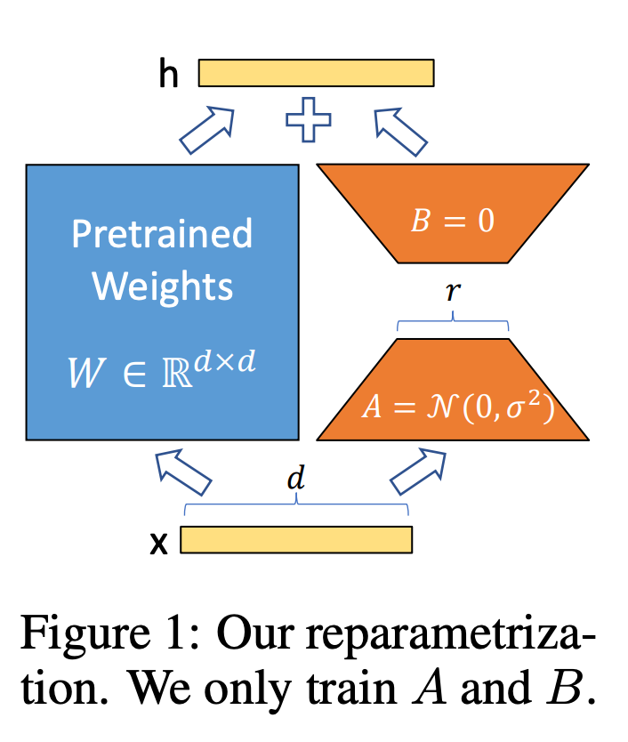

## Introduction
Recently, most natural language processing relies on a one-large-scale pre-trained language model to adapt to multiple downstream tasks. This adaptation involves fine-tuning the pre-trained model to update its full parameters. Large-scale models like GPT-3, with approximately 175 billion training parameters, require several months of training and substantial computing resources.

To address this inefficiency, a proposed approach involves adding task-specific external modules for downstream task learning. However, these proposed methods often increase inference latency due to an increase in the model's depth. Ultimately, these methods create a trade-off between efficiency and model quality during the fine-tuning process.

The authors of this paper assume that the changes in model weights during model adaptation have a low "intrinsic rank".

As depicted in the above figure, LoRA keeps pre-trained weights fixed and learns only a few dense layers (matrices A and B) by optimizing rank decomposition matrices.

LoRA's key advantages
- It allows effective learning by seamlessly swapping matrices A and B across multiple downstream tasks.
- LoRA efficiently trains by learning only injected small low-rank matrices, reducing hardware barriers by up to threefold.
- The linear design of LoRA results in no inference latency when compared to a fully fine-tuned model combining frozen weights and trainable matrices.

## Problem Statement
LoRA's approach is agnostic to the training objective, but in this paper, language modeling is set as the training objective. 
First, let's assume a pre-trained autoregressive language model parameterized by $\Phi$ as $P_{\Phi}(y|x)$. 
This pre-trained model is adapted to each downstream conditional text generation task.
During full fine-tuning, the model is initialized with pre-trained weights $\Phi_{0}$ and updated as the gradient maximizes conditional probabilities for task-specific prompts, resulting in the model being updated to $\Phi_{0}+\Delta\Phi$.
$$ \underset{\Phi}{\text{max}}\sum_{(x,y) \in \mathcal{Z}}\sum_{t=1}^{\left| y \right|}log(P_{\Phi}(y_{t}|x,y_{<t}))$$
The main drawback of full fine-tuning is that it learns parameters $\Delta\Phi$ with the same dimension size as $\Phi_{0}$ for each downstream task. Therefore, when using a large language model (LLM) like ChatGPT for fine-tuning, it involves retraining approximately $|\Phi_{0}| \approx 175 billion$ parameters.

In this paper, the task-specific parameter $\Delta\Phi = \Delta\Phi(\Theta)$ is encoded into a smaller-sized set of parameters $\Theta$. 
Finding $\Delta\Phi$ is equivalent to optimizing $\Theta$.
 $$ \underset{\Theta}{\text{max}}\sum_{(x,y) \in \mathcal{Z}}\sum_{t=1}^{\left| y \right|}log(P_{\Phi_{0}+\Delta\Phi(\Theta)}(y_{t}|x,y_{<t}))$$
LoRA efficiently computes and encodes $\Delta\Phi$ using a low-rank representation for both computational and memory efficiency.

## Experiments

## Conclusion

## My opinions or thinking

## Reference
- Lai, X., Tian, Z., Chen, Y., Li, Y., Yuan, Y., Liu, S., & Jia, J. (2023). Lisa: Reasoning segmentation via large language model. arXiv preprint arXiv:2308.00692.
- Hu, E. J., Shen, Y., Wallis, P., Allen-Zhu, Z., Li, Y., Wang, S., ... & Chen, W. (2021). Lora: Low-rank adaptation of large language models. arXiv preprint arXiv:2106.09685.