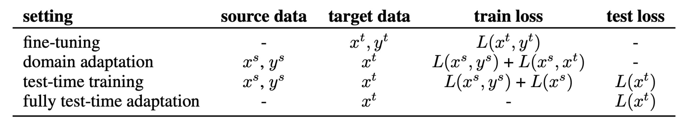
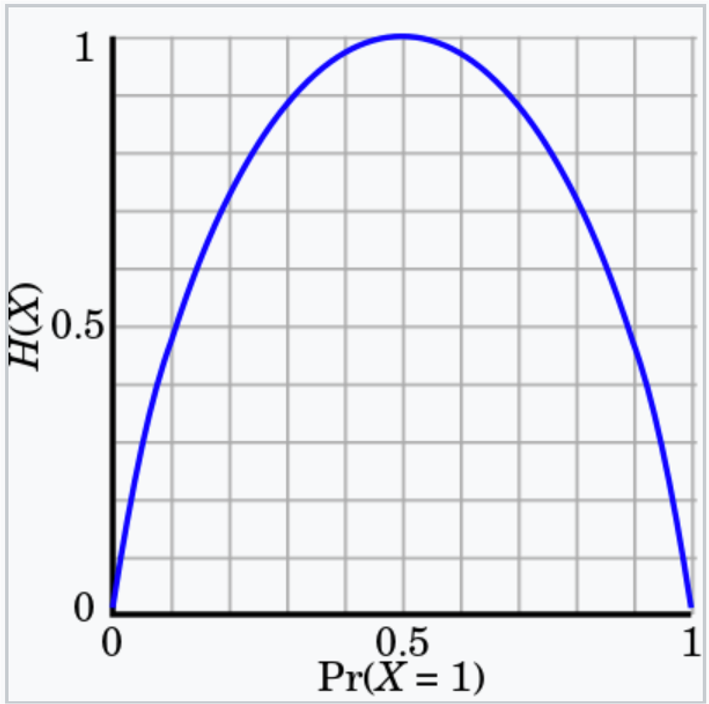
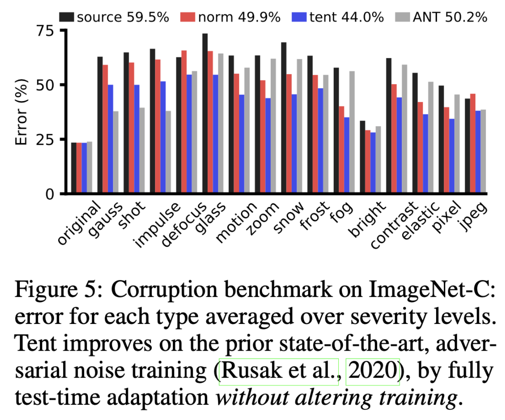
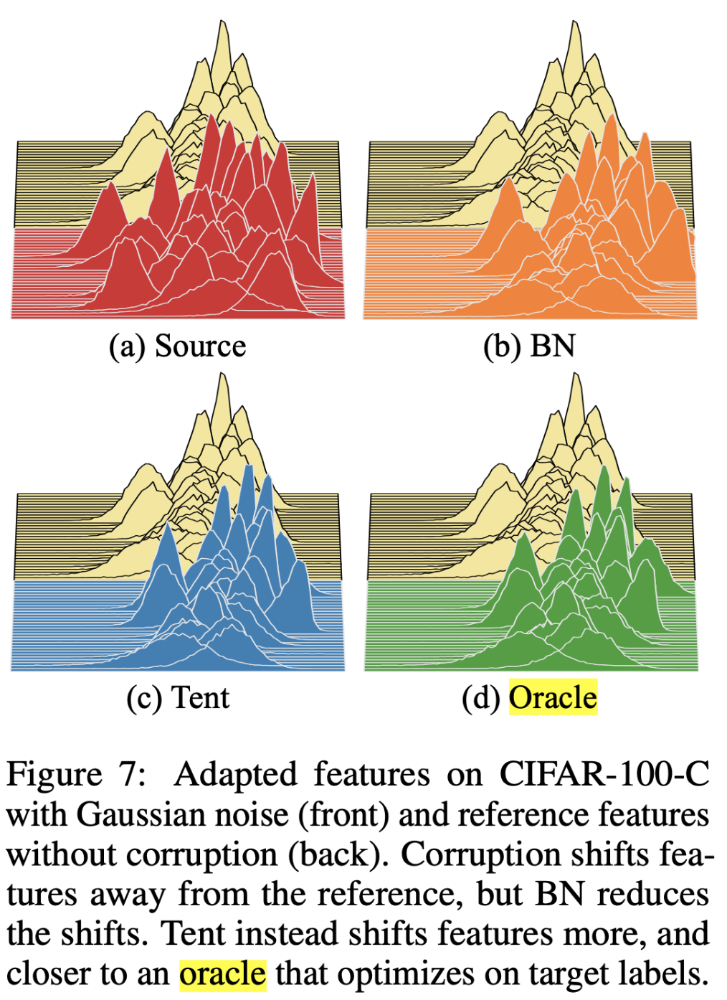

## Introduction
With the recent advancement in deep learning, various tasks in downstream applications such as classification, detection, segmentation, etc., have achieved the State of the Art (SOTA) performance. However, along with these advancements, issues have been raised. Among them, the domain shift problem, where the performance of deep learning deteriorates in situations where the distribution between training and testing data differs, is well-known. As those who have conducted research in the field of deep learning in industry are aware, deep learning works well in a static environment as expected. However, in fields such as autonomous driving and robotics, where the environment is constantly changing, algorithms may produce incorrect results.

The research field primarily addressing the domain shift problem is domain adaptation, and one of the recently popular areas within it is Test-Time Adaptation. Let's explore the differences. The table below illustrates the difference between domain adaptation and test-time adaptation, as explained in a paper called TENT. In domain adaptation, data is broadly classified into source and target (denoted as s and t in the table), where source represents training data, and target represents test data. It is important to note the assumption that "the distribution between the two datasets is different."

The assumptions of TTA can be broadly categorized into two main points:
- No Access to Source Data
- Availability of Target Data (Unlabeled) and Parameters trained with source data

 

 Similar to the assumptions mentioned above, the TTA problem involves adapting to target data using only parameters trained on the source due to situations where access to data is challenging, for instance, due to privacy concerns.

## Method: TEST entropy minimization via feature modulation

This paper introduces the concept of 'TENT' (Test Entropy) to address the TTA (Test-Time Adaptation) problem. The main idea is to obtain predictions for the test dataset and train the model to minimize entropy. The objective for training is as follows:


$$H(\hat{y})=-\sum_{c}p(\hat{y}) \ logp(\hat{y})$$


The above formula represents entropy in information theory, expressing the uncertainty of information. When represented graphically, with the x-axis as the probability (model predictions) and the y-axis as entropy, it is observed that entropy increases as the model's predictions become more uncertain.

 

As shown in the graph, training the model in the direction of reducing entropy leads to a bias towards probabilities of 0 or 1, indicating reduced uncertainty in the model.

The paper argues that updating all parameters of the model at test time is sensitive and inefficient. Therefore, the proposed method suggests updating only feature modulation, which includes normalization statistics and transformation parameters. The actual implementation involves updating only normalization layers.

## Experiments

Experiments were conducted on datasets such as CIFAR-10/CIFAR-100 with corruption, ImageNet, MNIST/SVHN, using Residual Networks (R-26 architecture). The compared methods include "Only Source," "test-time normalization" (updates batch normalization statistics on the target domain), and "Pseudo-Labeling" (tunes a confidence threshold, assigns pseudo-labels).

Error comparison results (x-axis represents the augmentation used for corruption) show that TENT consistently operates robustly for all types of augmentation.

 

## Analysis

The figures below represent the feature distribution for each method, making it an impressive analysis to showcase the effectiveness of the proposed method. In each figure, the front represents after adaptation, and the back represents before adaptation. BN refers to the method that updates only batch normalization for the target dataset, while Oracle is the case where the model is trained with target labels. It can be observed that using BN brings the feature closer to the reference feature, while TENT, although slightly different from the reference feature, exhibits features similar to Oracle. This demonstrates that Tent (test entropy) minimization can be applied to represent task-specific features.

 

## Conclusion

In conclusion, this paper felt like a practical approach proposing a new problem setting, TTA, that can be directly applied to the real world. The future direction of how to integrate deep learning algorithms into the real world seems to be a central focus. This is a personal perspective. As of 2023, related papers are continuously emerging in top-tier conferences based on this starting point. I recommend reading it for those interested!
