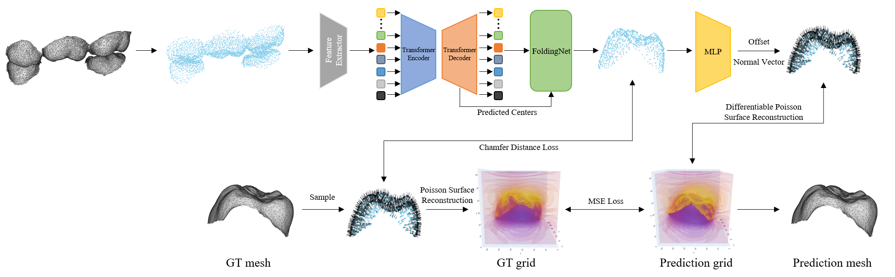

## Goal⛳️: Generate a crown mesh from adjacent tooth meshes
* It is crucial for the predicted target tooth to have proper occlusion without colliding with adjacent teeth, so the key point is for the model to understand the position of the adjacent teeth.
* Since the requirement for the patient's crown design is to output as a mesh, it is important to learn the connectivity between point clouds.

## Motivation 📚
 * Reduce time and manpower resources in dental labs by automating crown design.
 * Use the generation of various meshes for data augmentation.

## Data 🏦

### Data composition
* Format: Mesh
* Number of data points: 700
* Pairs of adjacent and target teeth

### Data preprocessing
* Rigid ICP is used to align the positions between all tooth datasets.
* Teeth are segmented by tooth number.
* Pairs are formed between the adjacent and target teeth for each segmented tooth.

## Approach
* Using the PoinTr model to solve the point completion problem, it is designed to understand the global positional information of adjacent teeth.
* Additionally, MLP is attached to predict the normal vectors from the point cloud to generate the mesh surface.
* To train the normal vector prediction, it is designed to solve the Poisson equation using Differentiable Poisson Surface Reconstruction.

## Workflow 👓
</img> 
1. Extract the point cloud from the adjacent tooth mesh.
2. Use the PoinTr model to generate the point cloud for the target tooth.
3. Pass the point cloud through an MLP to predict the offset and normal vector for the point cloud.
4. Perform Differentiable Poisson Surface Reconstruction using the point cloud and normal vector to create a surface grid (Prediction grid).
5. Sample point clouds and normal vectors from the GT mesh to create a GT grid.
6. Train using Chamfer Distance Loss between the GT point cloud and the predicted point cloud, and MSE Loss between the GT grid and the prediction grid.

