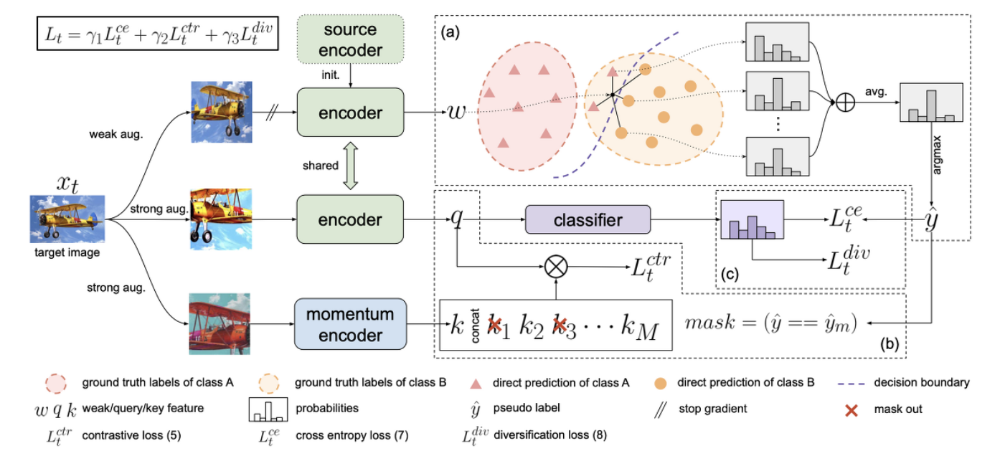
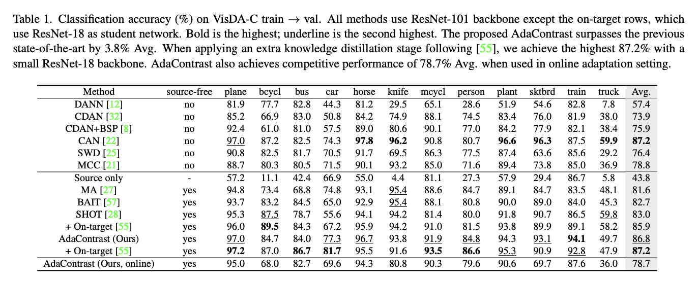
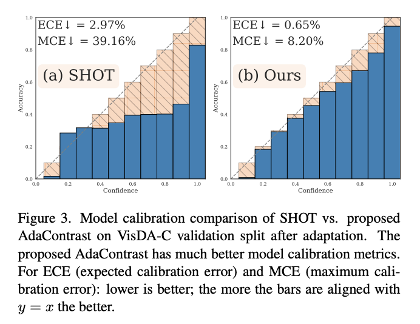

## Introduction
기존 Deep network는 학습데이터와 테스트 데이터가 similar한 distribution일때는 잘 동작해 왔습니다. 그러나, Real-World와 같이 unseen 데이터가 갑작스럽게 들어오는 경우에는 오작동하는 경우가 다반사입니다. 이러한 문제를 domain shift라고 합니다. 이 문제를 다루는 Domain Adaptation분야는 다양하게 연구되어오고 있습니다. 최근에는 TTA(Test-Time Adaptation)라는 분야가 연구가 활발히 되고 있습니다. 기본적인 problem setting은 source model에는 access가능하지만 data privacy와 같은 이유로 source data에는 no available한 상황을 가정하고 있습니다.

본 논문에서 말하는 TTA의 mojor challenge
- 어떻게 target domain의 label정보 없이 target domain의 representation을 학습할 수 있을까?
- source domain의 classifier만으로 target domain classifier를 만들 수 있을까?
위의 difficulty를 해결하기위해 제안하는 method는 크게 두가지 key factor가 있습니다.

- Self-Supervised Contrastive Learning
- Online Pseudo Labeling
위 두가지를 online으로 학습함으로 2022년 기준으로 TTA task에서 SOTA를 찍었네요. 

## Related Works
최근에 TTA를 다룬 논문인 TENT, SHOT과 간략히 설명해보겠습니다.TENT는 Target domain에 대해 Test Entropy를 minimization하는 objective통행 학습하는 전략이고, SHOT은 Pseudo Labeling를 이용해서 Entropy Minimization를 하는 전략을 취합니다. 본 논문에서 언급하는 두가지 method의 limitation은 다음과 같습니다.

> The entropy minimization does not model the relation among different samples.
More importantly, distrupts the model calibration on target data due to direct entropy optimization.
> The pseudo labels are updated only a per-epoch basis, which fails to reflect the most recent model improvment during an epoch.

## Method

**Online pseudo label refinement(위 그림 a)**

Online으로 pseudo label의 정제를 하기위해 epoch단위가 아닌 batch 단위로 pseudo label을 반영하도록 합니다. 그렇다면 정제는 어떻게 할까요? source data로 학습된 모델로 taerget encoder를 initiation 합니다.
taget image가 주어지면, weak augmentation를 통해 target encoder를 통과시켜 feature vector들을 만들어 냅니다. 그리고 target feature space에서 기존 target image 와 nearest neighbor를 voting하여 선택합니다. 선택된  feature vector들과 기존 target image의  feature vecotor w(weak feature)를 classifier에 태워 probability 평균을 산출합니다. 최종 pseudo label은 argmax를 통해 구합니다. 

Memory queue

위에서 다룬 nearest neighbor search를 하기 위해서, weak augmented target sample들의 feature, probability를 memory queue 길이 M만큼 저장합니다. 처음에는 random target sample를 사용하여 memory queue에서 관리됩니다. 제안 방법은 feature space를 보다 stable하게 하기 위해, 조금씩 바뀌는 momentum model를 feature, probability를 계산하기 위해 사용됩니다. 
Nearest-neighbor soft voting
위에서 Memory queue에 저장된 feature과 w(weak feature)와의 cosine distance를 계산합니다. 이 수치를 통해, nearest neighbor를 뽑아서 probability의 평균을 구해, argmax operation으로 pseudo label 만들어내게 됩니다.

**Joint self-supervised contrastive learning(위 그림 b, c)**

기존의 제안된 self-supervised contrastive learning의 아이디어에 영감을 받아서, target data의 pair-wise information를 추출합니다. 기존방식과 공유되는 점은 다음과 같습니다.
- Positive pairs: 같은 이미지의 different view들의 feature
- Negative pairs: 다른 이미지의 feature
즉, 골자는 Positive pairs는 서로 끌어당기고, Negative pairs는 서로 멀어지도록 학습하는 원리입니다.
 

Encoder initialization by source

제안된 방법의 momentum encoder는 source weight로 initialize되게 됩니다. 또한, momentum encoder는 memory queue를 update하는데 사용합니다. 즉, momentum encoder는 (a)에서 target feature, probability를 위한 memory queue 업데이트 및 (b)에서 contrastive feature를 만듭니다. 

Exclusion of same-class negative pairs

Strong augmentaion으로 만들어진 두개 버전의 target image는 query와 key faeture로 encoding됩니다. 그 중 key feature들은 memory queue에 update됩니다.(그림 (b)에 해당)(참고: 이 memory queue는 이전에 weak augmented target 들이 저장된 memory queue와는 별개입니다.). 제안 방법은 MoCo에서 사용된 InfoNCE Loss를 통해 positive, negative를 정의해 학습합니다. Positive는 query와 key feature 사이의 similarity, Negative는 query와  memory queue feature 사이의  similarity를 뜻합니다. 기존의 Contrastive learning의 개념에 따라, Positive pair의 similarity는 작아지도록, Negative  pair의 similarity는 커지도록 학습됩니다. 주의할 점은, negative pairs가운데는 같은 class도 포함되어 있기에 이를 제외하도록 합니다. 아래의 식이 위의 설명을 대변합니다.

 $$L_{t}^{ctr}=L_{infoNCE}=-log\frac{exp q \cdot k_{+} / \tau }{\sum_{j \in N_{q}}q \cdot k_{j} / \tau}$$
 $$N_{q}=\{j|1\leq j\leq P, j \in Z, \hat{y} \neq \hat{y}^{j}\}\cup \{0\}$$

최종적을 위의 세가지 loss를 통해, target domain에 대해 학습을 합니다.

Additional regularization

- Weak-strong consistency
TTA는 test에 대한  ground truth가 주어지지 않기에, weakly-augmented target image로부터 얻어지는 pseudo label를 가지고 strongly-augmented target image에 대한 예측에 대해 cross entorpy로 supervise합니다. 이는 weak-aug와 strong-aug의 예측의 consitency를 학습한다고 보면 됩니다. 본 논문에서는 ground truth를 가지고 있는 조건에서 refined pseudo label를  사용하기에 confidence thresholding도 하지 않기에 이점이 있다고 합니다.

$$L_{t}^{ce}=-\mathbb{E}_{x_{t} \in \mathcal{X}_{t}} \sum_{c=1}^{C}\hat{y}^{c} log p_{q}^{c}$$

- Diversity regularization
위에서 pseudo label를 만드는 과정이 noises를 줄여줄 수 있는 효과는 있지만, ideal하지않기에 제안 방법에서는 regularization term를 추가하였습니다. Class diversification를 주기위해 class diversification loss로 학습합니다.

$$L_{t}^{div}=-\mathbb{E}_{x_{t} \in \mathcal{X}_{t}} \sum_{c=1}^{C} \bar{p}_{q}^{c} log \bar{p}_{q}^{c}$$
$$\bar{p}_{q}=\mathbb{E}_{{x}_{t} \in \mathcal{X}_{t}} \sigma (g_{t}(t_{s}(x_{t})))$$

## Experiment Results

- Dataset: Visda-C, DomainNet-126
- Task: Classification
- Metric: Accuracy

위의 표는 Visda-C에 대한 class-wise accuracy를 보여줍니다. SoTA를 달성함과 동시에 주목할 점은 online test-time adaptation 가능하다는 점입니다. (table 마지막 row) 여기서 말하는 online, offline의 차이는 target domain에 대한 학습 epoch 수가 다른거를 말합니다. online은 오직 1 epoch 즉, inference phase에 학습을 하는 setting입니다. 그와 달리, offline은 target domain에 대해 여러 epoch동안 학습을 진행합니다.

## Analysis

위의 결과는 model calibration 분석 결과입니다. 저는 **model calibration** in test-time adaptation enhances the reliability, robustness, and interpretability of the adapted target model, making it a crucial aspect of deploying machine learning solutions in dynamic environment라고 생각합니다. 

기존의 shot논문보다 model calibration이 잘 되어 있다는것을 알 수 있습니다.
ECE, MCE score는 model calibration을 정량적으로 표현하는 지표로서, 작은 값일수록 더 model calibration이 좋은것을 의미합니다.

## Reference

- Chen, Dian, et al. "Contrastive test-time adaptation." Proceedings of the IEEE/CVF Conference on Computer Vision and Pattern Recognition. 2022.
- He, Kaiming, et al. "Momentum contrast for unsupervised visual representation learning." Proceedings of the IEEE/CVF conference on computer vision and pattern recognition. 2020.