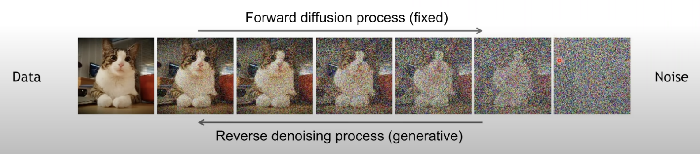
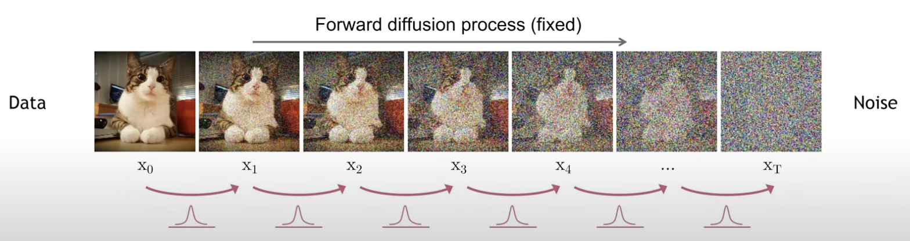
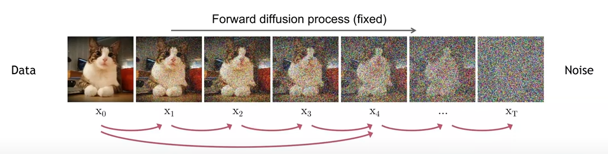
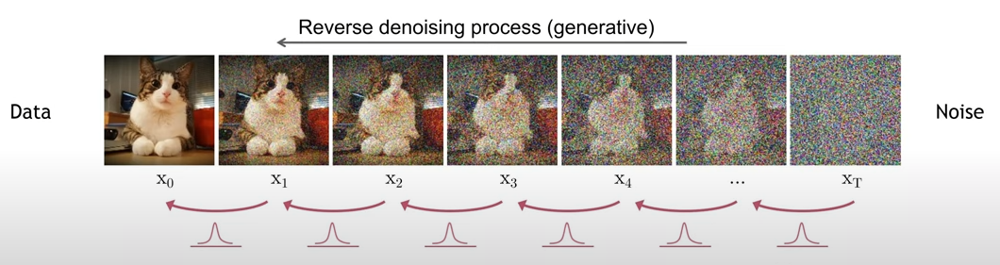
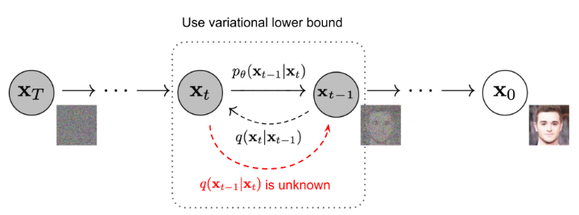

## Physical Intuition
Diffusion 아래의 그림과 같이 잉크를 물에 첨가하였을 때 퍼지게 되는 현상입니다.
잉크는 시간이 지나면 결국 고르게 분포하게 되고 Uniform하게 됩니다. 이때, 처음 잉크가 첨가되었을 때의 잉크의 밀도를 구하는 것은 어렵습니다. 여기서, Uniform한 잉크를 다시 처음 상태로 돌릴 수 있으면 어떨까요?? 딥러닝을 통해 해결해 보자!!

잉크를 분자단위로 보게 되면, 작은 Sequence단위로 보게 되면 가우시안 분포내에서 shifting이 일어나게 됩니다.

## Diffusion 

Diffusion은 아래의 그림과 같이 forward, reverse process로 구성됩니다. 
Forward process는 원본 이미지에서 노이즈가 첨가되어 가는 과정, Reverse process는 노이즈에서 원본 이미지로 생성하는 과정입니다.

### Forward Diffusion Process

Foward process는 아래의 그림처럼, 원본 이미지 $\mathbf{x}_ {0}$로부터 가이시안 노이즈를 점진적으로 첨가하면서 복수의 time step를 거쳐서 $\mathbf{x}_ {T}$로 도달하게 됩니다. 원본 이미지 $\mathbf{x}_ {0}$는 step $t$가 커짐에 따라서 점차 구별할수 있는 특징을 잃어버리게 됩니다. 결국, $T \to \infty$로 가까워지면 $\mathbf{x}_ {T}$는 등방성 가우시안 분포와 동일해집니다.

위의 과정에서 각 step은 아래의 식으로 표현할 수 있습니다. 각 step size는 variance schedule $\{\beta_{t}\in(0,1)\}$에 의해 조정되어집니다.
$$ q(\mathbf{x}_ {t}|\mathbf{x}_ {t-1}) = \mathcal{N}(\mathbf{x}_ {t};\sqrt{1-\beta_{t}}\mathbf{x}_ {t-1}, \beta_{t} \text{I})$$
일반적으로 $\beta$는 0에 가까운 작은 값을 가지기에, 위의 식을 해석해보면 이전 step의 값을 감소시키면서 $\beta$ 노이즈를 더해주는것으로 foward process를 정의할 수 있습니다.

전체 과정은 아래의 식처럼,  $\mathbf{x}_ {0}$라는 이미지가 주어지게 되면 그 이미지에 노이즈를 조금씩 추가하는 $\mathbf{x}_ {1}$에서 $\mathbf{x}_ {T}$까지 과정을 아래의 joint distribution으로 표현 가능합니다. 
$$ q(\mathbf{x}_ {1:T}|\mathbf{x}_ {0}) = \prod_{t=1}^{T}q(\mathbf{x}_ {t}|\mathbf{x}_ {t-1})$$

DDPM 논문에서는 아래와 같이 각 time step의 가우시안 커널들이 연속적이기에 어떤 time step $t$에서 만들어지는 이미지를 정의할 수 있게 됩니다.

임의의 $\mathbf{x}_ {t}$를 reparamerization trick를 사용하면 아래와 같이 샘플링 할 수 있습니다.
여기서, $\alpha=1-\beta_{t}$ 그리고 $\bar{\alpha_{t}} = \prod_{i=1}^{t} \alpha_{i}$라고 두고 $\mathbf{x}_ {t}$를 아래와 같이 유도할 수 있습니다.
$$
\mathbf{x}_ {t} &=\sqrt{\alpha_{t}}\mathbf{x}_ {t-1}+\sqrt{1-\alpha_{t}}\epsilon_{t-1} \\
& = \sqrt{\alpha_{t}}(\sqrt{\alpha_{t-1}}\mathbf{x}_ {t-2}+\sqrt{1-\alpha_{t-1}}\epsilon_{t-2})+\sqrt{1-\alpha_{t}}\epsilon_{t-1} \\
& = \sqrt{\alpha_{t}\alpha_{t-1}}\mathbf{x}_ {t-2}+\sqrt{\alpha_{t}(1-\alpha_{t-1})}\epsilon_{t-2}+\sqrt{1-\alpha_{t}}\epsilon_{t-1} \\
& = \sqrt{\alpha_{t}\alpha_{t-1}}\mathbf{x}_ {t-2}+\sqrt{1-\alpha_{t}\alpha_{t-1}}\epsilon_{t-2} \\
& = \sqrt{\bar{\alpha_{t}}}\mathbf{x}_ {0} + \sqrt{1-\bar{\alpha_{t}}}\epsilon
$$
식(3)에서 식(4)과정에는 두 개의 서로 다른 분산 $\mathcal{N}(0, \sigma_{1}^2), \mathcal{N}(0, \sigma_{2}^2)$을 가지는 가우시안 분포를 합치면 다음과 같은 하나의 분포로  $\mathcal{N}(0, (\sigma_{1}^2+\sigma_{2}^2)\text{I})$ 표현가능한 점을 이용하여 식을 전개했습니다.

그렇다면, 아래와 같이 $q(\mathbf{x}_ {t}|\mathbf{x}_ {0})$를 평균이 $\sqrt{\bar{\alpha}}\mathbf{x}_ {0}$, 분산이 $(1-\bar{\alpha})$인 가우시안 분포로 표현됩니다.
$$ q(\mathbf{x}_ {t}|\mathbf{x}_ {0}) = \mathcal{N}(\mathbf{x}_ {t};\sqrt{\bar{\alpha}}\mathbf{x}_ {0}, (1-\bar{\alpha})\text{I})$$
$$\text{For sampling:} \ \mathbf{x}_ {t}=\bar{\alpha}\mathbf{x}_ {0}+\sqrt{1-\bar{\alpha}}\epsilon$$
$$ \text{where} \ \epsilon \sim \mathcal{N}(0, \text{I})$$

### Reverse Diffusion Process

처음에 언급한대로, Diffusion 현상은 Reverse Process가 Forward Process와 동일하게 작은 sequence내에서는 가우시안 분포를 따른다는 물리적인 intuition이 있습니다. 따라서, reverse 과정도 가우시안 분포를 따른다고 가정할 수 있습니다. 그럼, 이러한 가우시안을 딥러닝을 통해 모델링 할 수 있게 됩니다.

$q(\mathbf{x}_ {t-1}|\mathbf{x}_ {t})$를 directly 추정하는 것은 모든 데이터셋이 있어야 가능한 일이기에 구하는 것은 현실적으로 매우 어렵습니다. 그 대신, 우리가 학습할 딥러닝 모델 $p_{\theta}$가 앞선 conditional probability $q(\mathbf{x}_ {t-1}|\mathbf{x}_ {t})$를 approximate하도록 학습을 진행합니다.
특히, 아래와 같이 $\mathbf{x}_ {0}$가 주어졌을 때, 역조건부 확률 $q(\mathbf{x}_ {t-1}|\mathbf{x}_ {t})$를 추정할 수 있게 됩니다.
$$q(\mathbf{x}_ {t-1}|\mathbf{x}_ {t}, \mathbf{x}_ {0}) = \mathcal{N}(\mathbf{x}_ {t-1}; \tilde{\mu}(\mathbf{x}_ {t}, \mathbf{x}_ {0}),\tilde{\beta}\text{I} )$$

그리고 전체적인 Reverse 과정은 아래와 같습니다.

$$ p_{\theta}(\mathbf{x}_ {0:T})=p(\mathbf{x}_ {T})\prod_{t=1}^Tp_{\theta}(\mathbf{x}_ {t-1}|\mathbf{x}_ {t}), \ p_{\theta}(\mathbf{x}_ {t-1}|\mathbf{x}_ {t})=\mathcal{N}(\mathbf{x}_ {t-1};\mu_{\theta}(\mathbf{x}_ {t},t), \sum_{\theta}(\mathbf{x}_t,t))$$
즉, 네트워크는 위의 평균과 분산을 가지는 가우시안 분포를 학습하게 됩니다.

베이즈 룰을 적용하면 $q(\mathbf{x}_ {t-1}|\mathbf{x}_ {t})$를 아래처럼 유도가능하게 됩니다.
$$
\begin{aligned}
q(\mathbf{x}_ {t-1}|\mathbf{x}_ {t},\mathbf{x}_ {0})&=q(\mathbf{x}_ {t}|\mathbf{x}_ {t-1},\mathbf{x}_ {0})\frac{q(\mathbf{x}_ {t-1}|\mathbf{x}_ {0})}{q(\mathbf{x}_ {t}|\mathbf{x}_ {0})} \\
&\propto  \text{exp}(-\frac{1}{2}(\frac{(\mathbf{x}_ {t}-\sqrt{\alpha_{t}}\mathbf{x}_ {t-1})^{2}}{\beta_{t}}+\frac{(\mathbf{x}_ {t-1}-\sqrt{\bar{\alpha}_{t-1}}\mathbf{x}_ {0})^{2}}{1-\bar{\alpha}_{t-1}}-\frac{(\mathbf{x}_ {t}-\sqrt{\bar{\alpha}_{t}}\mathbf{x}_ {0})^{2}}{1-\bar{\alpha}_{t}})) \\
&= \text{exp}(-\frac{1}{2}(\frac{\mathbf{x}_ {t}^2-2\sqrt{\alpha_{t}}\mathbf{x}_ {t}\mathbf{x}_ {t-1}+\alpha_{t}\mathbf{x}_ {t-1}^2}{\beta_{t}}+\frac{\mathbf{x}_ {t-1}^2-2\sqrt{\bar\alpha_{t-1}}\mathbf{x}_ {0}\mathbf{x}_ {t-1}+\bar\alpha_{t-1}\mathbf{x}_ {0}^2}{1-\bar\alpha_{t-1}}-\frac{(\mathbf{x}_ {t}-\sqrt{\bar{\alpha}_{t}}\mathbf{x}_ {0})^{2}}{1-\bar{\alpha}_{t}})) \\
&= \text{exp}(-\frac{1}{2}((\frac{\alpha_{t}}{\beta_{t}}+\frac{1}{1-\bar\alpha_{t-1}})\mathbf{x}_ {t-1}^2-(\frac{2\sqrt{\alpha_{t}}}{\beta_{t}}\mathbf{x}_ {t}+\frac{2\sqrt{\bar\alpha_{t-1}}}{1-\bar\alpha_{t-1}}\mathbf{x}_ {0})\mathbf{x}_ {t-1}+C(\mathbf{x}_ {t},\mathbf{x}_ {0})))
\end{aligned}
$$
여기서, $C(\mathbf{x}_ {t},\mathbf{x}_ {0})$는 $\mathbf{x}_ {t-1}$를 포함하지 않는 함수입니다. standard gaussian density function에 의해, 평균과 분산은 아래와 같이 parameterized됩니다.

$$\tilde{\beta}=1/(\frac{\alpha_{t}}{\beta_{t}}+\frac{1}{1-\bar\alpha_{t-1}})=\frac{1-\bar\alpha_{t-1}}{1-\bar\alpha_{t}}\cdot\beta_{t}$$
$$
\begin{aligned}
\tilde{\mu}(\mathbf{x}_ {t}, \mathbf{x}_ {0})&=(\frac{\sqrt{\alpha_{t}}}{\beta_{t}}\mathbf{x}_ {t}+\frac{\sqrt{\bar\alpha_{t-1}}}{1-\bar\alpha_{t-1}}\mathbf{x}_ {0})\frac{1-\bar\alpha_{t-1}}{1-\bar\alpha_{t}}\cdot\beta_{t} \\
&= \frac{\sqrt{\alpha_{t}}(1-\bar\alpha_{t-1})}{(1-\bar\alpha_{t})}\mathbf{x}_ {t}+\frac{\sqrt{\bar\alpha_{t-1}}\beta_{t}}{1-\bar\alpha_{t}}\mathbf{x}_ {0} \\
&= \frac{\sqrt{\alpha_{t}}(1-\bar\alpha_{t-1})}{(1-\bar\alpha_{t})}\mathbf{x}_ {t}+\frac{\sqrt{\bar\alpha_{t-1}}\beta_{t}}{1-\bar\alpha_{t}}\frac{1}{\sqrt{\bar\alpha_{t}}}(\mathbf{x}_ {t}-\sqrt{1-\bar\alpha_{t}}\epsilon_{t}) \\
&= \frac{1}{\sqrt{\alpha_{t}}}(\mathbf{x}_ {t}-\frac{1-\alpha_{t}}{\sqrt{1-\bar\alpha_{t}}}\epsilon_{t})
\end{aligned}
$$

아래의 그림처럼, 이러한 setup는 VAE와 비슷하기에 variational lower bound를 사용하여 negative log-likelihood를 최적화하게 됩니다.  

$$
\begin{aligned}
-\text{log}p_{\theta}(\mathbf{x}_ {0}) &\leq -\text{log}p_{\theta}(\mathbf{x}_ {0}) + D_{KL}(q(\mathbf{x}_ {1:T}|\mathbf{x}_ {0})||p_{\theta}(\mathbf{x}_ {1:T}|\mathbf{x}_ {0})) \\
&= -\text{log}p_{\theta}(\mathbf{x}_ {0}) + \mathbb{E}_{\mathbf{x}_ {1:T} \sim q(\mathbf{x}_ {1:T}|\mathbf{x}_ {0})}\left [\text{log}\frac{q(\mathbf{x}_ {1:T}|\mathbf{x}_ {0})}{p_{\theta}(\mathbf{x}_ {0:T})/p_{\theta}(\mathbf{x}_ {0})}  \right ] \\
&= -\text{log}p_{\theta}(\mathbf{x}_ {0}) + \mathbb{E}_{q}\left [\text{log}\frac{q(\mathbf{x}_ {1:T}|\mathbf{x}_ {0})}{p_{\theta}(\mathbf{x}_ {0:T})}+\text{log}p_{\theta}(\mathbf{x}_ {0})  \right ] \\
&= \mathbb{E}_{q}\left [\text{log}\frac{q(\mathbf{x}_ {1:T}|\mathbf{x}_ {0})}{p_{\theta}(\mathbf{x}_ {0:T})}\right ] \\
\text{Let} \ L_{VLB} &= \mathbb{E}_{q(\mathbf{x}_ {0:T})}\left [\text{log}\frac{q(\mathbf{x}_ {1:T}|\mathbf{x}_ {0})}{p_{\theta}(\mathbf{x}_ {0:T})}\right ] \geq \mathbb{E}_{q(\mathbf{x}_ {0})}\text{log}p_{\theta}(\mathbf{x}_ {0})
\end{aligned}
$$

$L_{VLB}$는 아래와 같이 KL-divergence 및 entropy term으로 전개할 수 있습니다.
$$
\begin{aligned}
L_{VLB} &= \mathbb{E}_{q(\mathbf{x}_ {0:T})}\left [\text{log}\frac{q(\mathbf{x}_ {1:T}|\mathbf{x}_ {0})}{p_{\theta}(\mathbf{x}_ {0:T})}\right ] \\
&= \mathbb{E}_q \left [\text{log}\frac{\prod_{t=1}^Tq(\mathbf{x}_ {t}|\mathbf{x}_ {t-1})}{p_{\theta}(\mathbf{x}_ {T})\prod_{t=1}^{T}p_{\theta}(\mathbf{x}_ {t-1}|\mathbf{x}_ {t})}  \right ] \\
&= \mathbb{E}_q\left [-\text{log}p_{\theta}(\mathbf{x}_ {T})+\prod_{t=1}^T\text{log}\frac{q(\mathbf{x}_ {t}|\mathbf{x}_ {t-1})}{p_{\theta}(\mathbf{x}_ {t-1}|\mathbf{x}_ {t})} \right ] \\
&= \mathbb{E}_q\left [-\text{log}p_{\theta}(\mathbf{x}_ {T})+\prod_{t=2}^T\text{log}\frac{q(\mathbf{x}_ {t}|\mathbf{x}_ {t-1})}{p_{\theta}(\mathbf{x}_ {t-1}|\mathbf{x}_ {t})}+\text{log}\frac{q(\mathbf{x}_ {1}|\mathbf{x}_ {0})}{p_{\theta}(\mathbf{x}_ {0}|\mathbf{x}_ {1})} \right ] \\
&= \mathbb{E}_q\left [-\text{log}p_{\theta}(\mathbf{x}_ {T})+\prod_{t=2}^T\text{log}(\frac{q(\mathbf{x}_ {t-1}|\mathbf{x}_ {t}, \mathbf{x}_ {0})}{p_{\theta}(\mathbf{x}_ {t-1}|\mathbf{x}_ {t})} \cdot \frac{q(\mathbf{x}_ {t}|\mathbf{x}_0)}{q(\mathbf{x}_ {t-1}|\mathbf{x}_0)})+\text{log}\frac{q(\mathbf{x}_ {1}|\mathbf{x}_ {0})}{p_{\theta}(\mathbf{x}_ {0}|\mathbf{x}_ {1})} \right ] \\
&= \mathbb{E}_q\left [-\text{log}p_{\theta}(\mathbf{x}_ {T})+\prod_{t=2}^T\text{log}\frac{q(\mathbf{x}_ {t-1}|\mathbf{x}_ {t}, \mathbf{x}_ {0})}{p_{\theta}(\mathbf{x}_ {t-1}|\mathbf{x}_ {t})}  + \prod_{t=2}^T\text{log}\frac{q(\mathbf{x}_ {t}|\mathbf{x}_0)}{q(\mathbf{x}_ {t-1}|\mathbf{x}_0)}+\text{log}\frac{q(\mathbf{x}_ {1}|\mathbf{x}_ {0})}{p_{\theta}(\mathbf{x}_ {0}|\mathbf{x}_ {1})} \right ] \\
&= \mathbb{E}_q\left [-\text{log}p_{\theta}(\mathbf{x}_ {T})+\prod_{t=2}^T\text{log}\frac{q(\mathbf{x}_ {t-1}|\mathbf{x}_ {t}, \mathbf{x}_ {0})}{p_{\theta}(\mathbf{x}_ {t-1}|\mathbf{x}_ {t})}  + \text{log}\frac{q(\mathbf{x}_ {T}|\mathbf{x}_0)}{q(\mathbf{x}_ {1}|\mathbf{x}_0)}+\text{log}\frac{q(\mathbf{x}_ {1}|\mathbf{x}_ {0})}{p_{\theta}(\mathbf{x}_ {0}|\mathbf{x}_ {1})} \right ] \\
&= \mathbb{E}_q\left [-\text{log}\frac{q(\mathbf{x}_ {T}|\mathbf{x}_ {0})}{p_{\theta}(\mathbf{x}_ {T})} + \prod_{t=2}^T\text{log}\frac{q(\mathbf{x}_ {t-1}|\mathbf{x}_ {t}, \mathbf{x}_ {0})}{p_{\theta}(\mathbf{x}_ {t-1}|\mathbf{x}_ {t})}-\text{log}p_{\theta}(\mathbf{x}_ {0}|\mathbf{x}_ {1})\right ] \\
&= \mathbb{E}_q\left [D_{KL}(q(\mathbf{x}_ {T}|\mathbf{x}_ {0}) || p_{\theta}(\mathbf{x}_ {T})) + \prod_{t=2}^TD_{KL}(q(\mathbf{x}_ {t-1}|\mathbf{x}_ {t}, \mathbf{x}_ {0}) || p_{\theta}(\mathbf{x}_ {t-1}|\mathbf{x}_ {t}))-\text{log}p_{\theta}(\mathbf{x}_ {0}|\mathbf{x}_ {1})\right ]
\end{aligned}
$$
위의 식으로부터, $L_{VLB}$는 다음과 같이 분리됩니다.
$$
\begin{aligned}
L_{VLB}&=L_{T}+L_{T-1}+\cdot\cdot\cdot+L_{0} \\
\text{where} \ L_{T}&=D_{KL}(q(\mathbf{x}_ {T}|\mathbf{x}_ {0}) || p_{\theta}(\mathbf{x}_ {T})) \\
L_{t}&=D_{KL}(q(\mathbf{x}_ {t}|\mathbf{x}_ {t+1}, \mathbf{x}_ {0}) || p_{\theta}(\mathbf{x}_ {t}|\mathbf{x}_ {t+1})) \ \text{for} \ 1 \le t \le T-1 \\
L_{0}&=-\text{log}p_{\theta}(\mathbf{x}_ {0}|\mathbf{x}_ {1})
\end{aligned}
$$

$L_{T}$와 $L_{t}$는 두개의 가우시안 분포를 비교하는 항이 됩니다. 특히, $L_{T}$는 $q$가 학습 파라미터가 없고 $\mathbf{x}_ {T}$는 가우시안 노이즈이기에 constant한 값을 가진다는 것을 알 수 있습니다. 

### $L_{t}$를 학습하기 위한 Parameter로!
위에서 언급한대로, Reverse 과정에는 Neural Network $p_{\theta}(\mathbf{x}_ {t-1}|\mathbf{x}_ {t})=\mathcal{N}(\mathbf{x}_ {t-1};\mu_{\theta}(\mathbf{x}_ {t},t), \sum_{\theta}(\mathbf{x}_t,t))$가 conditional probability $q(\mathbf{x}_ {t-1}|\mathbf{x}_ {t})$를 approximate하도록 학습를 합니다. 그렇다면, $p_{\theta}(\mathbf{x}_ {t-1}|\mathbf{x}_ {t})$의 평균 $\mu_{\theta}$가 $q(\mathbf{x}_ {t-1}|\mathbf{x}_ {t})$의 평균 $\tilde{\mu}=\frac{1}{\sqrt{\alpha_{t}}}(\mathbf{x}_ {t}-\frac{1-\alpha_{t}}{\sqrt{1-\bar\alpha_{t}}}\epsilon_{t})$를 예측하도록 학습하면 된다는 것입니다. 학습하는 과정에서는 우리는 ${x}_{t}$를 샘플링할 수 있기에, 가우시안 노이즈 항을 reparameterize함으로써 time step $t$에서 $\mathbf{x}_ {t}$로부터 $\epsilon_{t}$를 예측하는 문제로 대치할 수 있습니다.
$$
\begin{aligned}
\mu_{\theta}(\mathbf{x}_ {t},t)&=\frac{1}{\sqrt{\alpha_{t}}}(\mathbf{x}_ {t}-\frac{1-\alpha_{t}}{\sqrt{1-\bar\alpha_{t}}}\epsilon_{\theta}(\mathbf{x}_ {t},t)) \\
\text{Thus} \ \mathbf{x}_ {t-1}&=\mathcal{N}(\mathbf{x}_ {t-1};\frac{1}{\sqrt{\alpha_{t}}}(\mathbf{x}_ {t}-\frac{1-\alpha_{t}}{\sqrt{1-\bar\alpha_{t}}}\epsilon_{t}(\mathbf{x}_ {t},t)), \sum_{\theta}(\mathbf{x}_t,t))
\end{aligned}
$$

$L_{t}$는 $\tilde{\mu}$와 차이를 최소하는 방향으로 학습됩니다.

$$
\begin{aligned}
L_{t}&=\mathbb{E}_{\mathbf{x}_ {0},\epsilon}\left [\frac{1}{2\left\|\sum_{\theta}(\mathbf{x}_ {t},t) \right\|_{2}^{2}}\left\| \tilde{\mu}(\mathbf{x}_ {t},t)-\mu_{\theta}(\mathbf{x}_ {t},t)\right\|^{2}  \right ] \\
&=\mathbb{E}_{\mathbf{x}_ {0},\epsilon}\left [\frac{1}{2\left\|\sum_{\theta} \right\|_{2}^{2}}\left\|\frac{1}{\sqrt{\alpha_{t}}}(\mathbf{x}_ {t}-\frac{1-\alpha_{t}}{\sqrt{1-\bar\alpha_{t}}}\epsilon_{t})- \frac{1}{\sqrt{\alpha_{t}}}(\mathbf{x}_ {t}-\frac{1-\alpha_{t}}{\sqrt{1-\bar\alpha_{t}}}\epsilon_{\theta}(\mathbf{x}_ {t},t))\right\|^{2}\right ] \\
&=\mathbb{E}_{\mathbf{x}_ {0},\epsilon}\left [\frac{(1-\alpha_{t})^{2}}{2\alpha_{t}(1-\bar{\alpha}_{t})\left\|\sum_{\theta} \right\|_{2}^{2}}\left\|\epsilon_{t}-\epsilon_{\theta}(\mathbf{x}_ {t},t)\right\|^{2}\right ] \\
&=\mathbb{E}_{\mathbf{x}_ {0},\epsilon}\left [\frac{(1-\alpha_{t})^{2}}{2\alpha_{t}(1-\bar{\alpha}_{t})\left\|\sum_{\theta} \right\|_{2}^{2}}\left\|\epsilon_{t}-\epsilon_{\theta}(\sqrt{\bar{\alpha_{t}}}\mathbf{x}_ {0} + \sqrt{1-\bar{\alpha_{t}}}\epsilon_{t},t)\right\|^{2}\right ] \\
\end{aligned}
$$

DDPM의 실험에서 위의 식의 앞부분인 weighting term은 무시하는게 diffusion model이 더 잘 작동된다는 결과로부터 아래의 식으로 simplify할 수 있습니다.
$$
\begin{aligned}
L_{t}^{simple}&=\mathbb{E}_{t \sim [1,T],\mathbf{x}_ {0},\epsilon_{t}}\left [\left\|\epsilon_{t}-\epsilon_{\theta}(\mathbf{x}_ {t},t) \right\|^{2}  \right ] \\
&=\mathbb{E}_{t \sim [1,T],\mathbf{x}_ {0},\epsilon_{t}}\left [\left\|\epsilon_{t}-\epsilon_{\theta}(\sqrt{\bar{\alpha_{t}}}\mathbf{x}_ {0} + \sqrt{1-\bar{\alpha_{t}}}\epsilon_{t},t) \right\|^{2}  \right ]
\end{aligned}
$$

