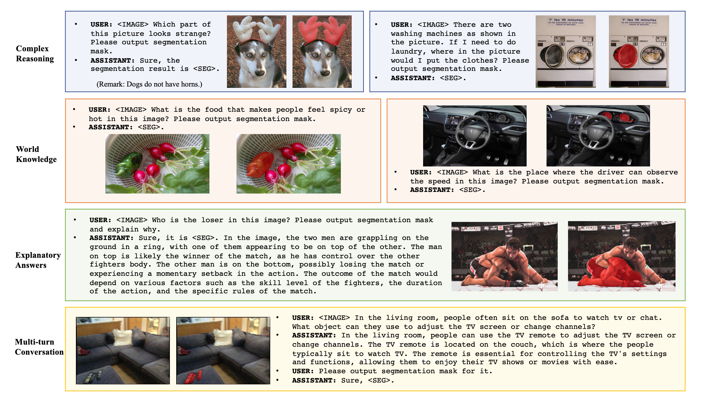
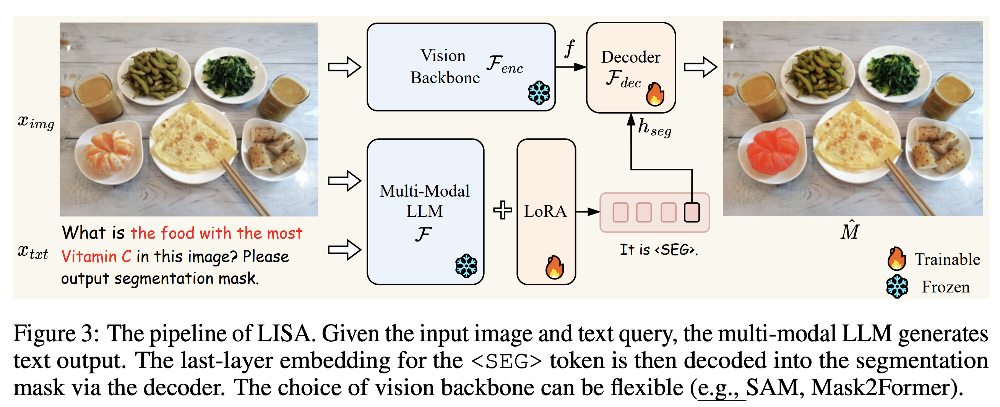
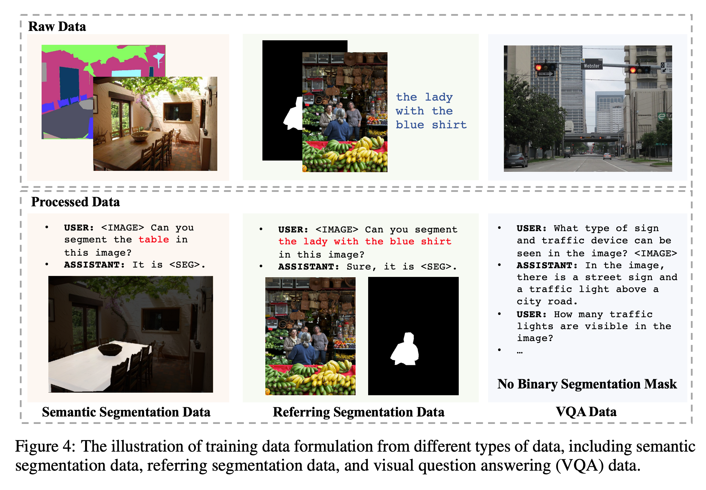

## Introduction
일상에서, 유저들은 “먼저 테이블로 가서, TV 리모컨을 찾고, 버튼을 눌러서 채널을 바꿔줘”라고 로봇에게 지시하기보다는 “TV 채널을 바꿔줘”라고 지시하게 됩니다. 그러나, 대부분의 perception system들은 사람이 명시적으로 정한 target object나 category에 의존하게 됩니다. 이러한 시스템들은 암묵적 지시로부터 유저의 의도를 적극적으로 추론하고 이해하는 능력이 부족합니다. 

이 논문은 “reasoning segmentation”라는 새로운 segmentation task를 제안합니다. 이 task는 complex하고 implicit query text가 주어졌을때, segmentation 출력하도록 디자인 되어집니다. 흥미로운 점은, query text가 “the orange”와 같이 명시적인 것을 포함하면서 “the food with high Vitamin C”와 같이 complex reasoning또는 word knowledge를 동반하는 복잡한 description까지 해당된다는 것입니다. 이러한 task를 이루기위해서는 모델이 두가지 key ability가 필요합니다. 1) reasoning complex and implicit text queries jointly with the image 2) producing segmentation masks

최근의 LLM의 뛰어난 이해와 추론 능력에 통해, 해당 논문 저자들은 LLM의 이러한 능력을 활용한다고 합니다. 여러 연구에서는 visual input를 수용하기위해 multi-modal LLM를 적용하고 있지만, 이러한 모델은 대부분 주로 텍스트 생성 task이며 segmentation mask와 같은 fine-grained된 output를 출력하는 task에 대한 성과는 미흡하다고 합니다.

이 논문에서는 LISA(Large Language Instructed Segmentation Assistant)를 소개합니다. 이는 multi-modal에 segmentation 능력을 부여하기 위해 기존 text에 "< SEG >"라는 추가 토큰을 포함합니다. < SEG > 토큰을 생성하는데 hidden embedding이 segmentation mask로 decoding를 합니다. 놀라운 점은 LISA는 zero-shot능력을 겸비하고 있을 뿐만아니라 segmentation과 referring segmentation으로 학습을 하여도 complex reasoning에도 효과적 성능을 보여줍니다. 더 나아가, 239개의 image-instuction reasoning segmentation pairs로 fine-tunining함으로써 LISA의 성능이 크게 향상됨을 확인합니다. 즉, LISA는 다음과 같은 4개의 scenarios를 다룰 수 있습니다. 1)complex reasoning 2) world knowledge 3) explanatory answers 4) multi-turn conversations. 아래의 Figure가 예시입니다.

## Method
 

LISA의 방법은 위의 그림의 pipeline를 이해하면 됩니다. 먼저 input으로 $x_{img}, x_{txt}$를 받은 multi-modal LLM $\mathcal{F}$은 $\hat{y}_{txt}$를 출력합니다. segmentation mask를 생성하기위해서는, output $\hat{y}_{txt}$이 < SEG >를 포함해야합니다. < SEG > token에 해당하는 마지막 layer의 embedding $\hat{h}_{seg}$를 추출하여 MLP projection layer $\gamma$를  적용하여 $h_{seg}$를 얻습니다. 동시에, vision backbone $\mathcal{F}_{enc}$가 input $x_{img}$로부터 visual embedding $f$를 추출합니다. 마지막으로, $h_{seg}$와 $f$를 decoder $\mathcal{F}_{dec}$에 입력하여 최종 segmentation mask $\hat{M}$를 출력합니다.

**Training Objectives.**
위 모델은 text generation loss $L_{txt}$와 segmentation mask loss $L_{mask}$ end-to-end로 학습됩니다. $L_{txt}$는 auto-regressive crosse entropy, $L_{mask}$는 per-pixel binary cross-entropy loss와 DICE loss로 정의됩니다. 

**Training Data Formulation**
아래의 그림처럼, 3가지의 다른 타입(Semantic Segmentation, Referring Segmentation, Visual Question Answering)의 public datasets에 대해 학습을 위해서 visual question anwering에 적합한 template를 주게 됩니다. 

 

## Experiments

## Analysis

## Conclusion

## Reference
- Lai, X., Tian, Z., Chen, Y., Li, Y., Yuan, Y., Liu, S., & Jia, J. (2023). Lisa: Reasoning segmentation via large language model. arXiv preprint arXiv:2308.00692.