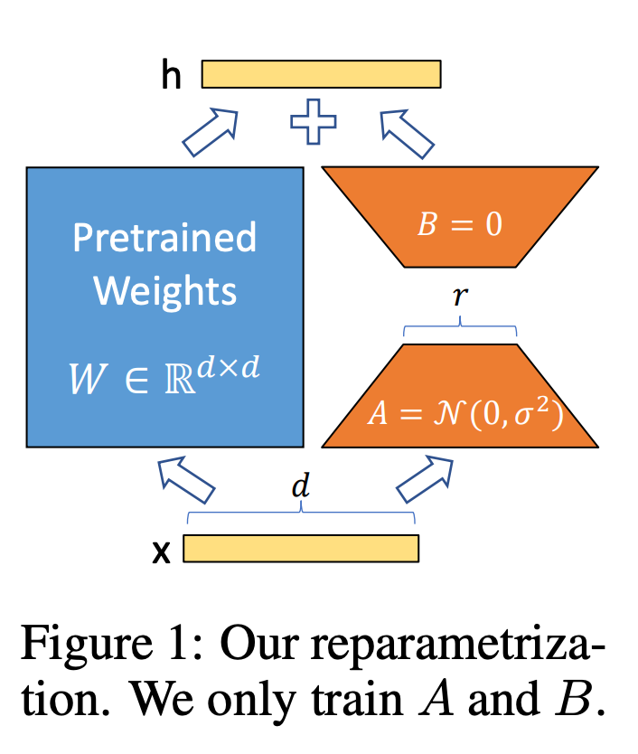

## Introduction
최근 대부분의 natural language processing은 multiple downstream task에 adaptation하기위해 one-large-scale로 pre-trained된 language model에 의존하고 있습니다. 이러한 adaptation은 pre-trained model을 fine-tune하여 model의 full parameters를 업데이트하게 됩니다. GPT-3와 같은 large-scale model은 약 175B의 학습 parameters를 갖고 있기에 학습을 하려면 몇 달이 걸리고, 엄청난 computing resources들이 요구됩니다. 

이러한 inefficiency를 피하기 위해, downstream task를 위한 task-specific external module를 추가하여 학습을 하는 방식이 제안되어 왔습니다. 제안된 방법들은 대게 model의 depth의 증가로  inference latency를 야기시킵니다. 결국 이러한 methods는 fine-tune를 수행하면서, efficiency와 model quality사이를 trade-off를 가지게 됩니다.

이 논문의 저자들은 model adaptation를 수행하는 가운데 model weight의 변화는 low “intrinsic rank”를 가진다라고 가정합니다.

위의 그림처럼, LoRA는 pre-trained weight는 고정하고, rank decomposition matrices를 optimizing함으로써 몇몇의 dense layer들(matrices A and B)만을 학습합니다. 

LoRA's key advantages
- Matrices A 와 B를 여러 downstream tasks에서 효과적으로 바꿔가면서 학습이 가능합니다.
- LoRA는 injected small low-rank matrices만을 학습하기에 training effient하고 hardware의 장벽을 3배까지 낮춰줍니다.
- LoRA의 linear design은 frozen weights와 trainable matrices가 합쳐져 fully fine-tuned model과 비교하였을때, inference latency가 없습니다.

## Problem Statement
LoRA의 방법은 training objective에 agnostic하지만, 이 논문에서느 language modeling를 trainig objectvie로 둡니다. 
먼저, $\Phi$로 parameterized pre-trained autoregressive language model $P_{\Phi}(y|x)$ 있다고 가정합니다. 
이 pre-trained model를 각 downstream conditional text generation task에 adaptation됩니다.
full fine-tunning 하는 동안에, 모델은 pre-trained wiehgts $\Phi_{0}$로 초기화 되고 task-specific promt에 대해 conditional probabilities가 최대화하기위해 gradient가 update 되면서 모델이 $\Phi_{0}+\Delta\Phi$로 업데이트 됩니다.
$$ \underset{\Phi}{\text{max}}\sum_{(x,y) \in \mathcal{Z}}\sum_{t=1}^{\left| y \right|}log(P_{\Phi}(y_{t}|x,y_{<t}))$$
full fine-tunning의 주된 단점은 각 downstream task를 수행할때, $\Phi_{0}$와 같은 dimension size를 가지는 $\Delta\Phi$의 parameters를 학습한다는 것입니다. 
따라서, chat-gpt와 같은 LLM을 fine-tunning 사용하게 되면 약 $|\Phi_{0}| \approx 175 Billon$의 parameters를 다시 학습해야하는 일이 발생합니다.

이 논문에서는, task-specific parameter $\Delta\Phi = \Delta\Phi(\Theta)$를 smaller-sized set of parameters $\Theta$로 인코딩합니다.
 $\Delta\Phi$를 찾는 task는 $\Theta$를 최적화하는것과 동치됩니다.
 $$ \underset{\Theta}{\text{max}}\sum_{(x,y) \in \mathcal{Z}}\sum_{t=1}^{\left| y \right|}log(P_{\Phi_{0}+\Delta\Phi(\Theta)}(y_{t}|x,y_{<t}))$$
LoRA는 low-rank representation를 사용하여 $\Delta\Phi$를 계산과 메모리적으로 효율적으로 인코딩합니다.

## Experiments

## Conclusion

## My opinions or thinking

## Reference
- Lai, X., Tian, Z., Chen, Y., Li, Y., Yuan, Y., Liu, S., & Jia, J. (2023). Lisa: Reasoning segmentation via large language model. arXiv preprint arXiv:2308.00692.
- Hu, E. J., Shen, Y., Wallis, P., Allen-Zhu, Z., Li, Y., Wang, S., ... & Chen, W. (2021). Lora: Low-rank adaptation of large language models. arXiv preprint arXiv:2106.09685.