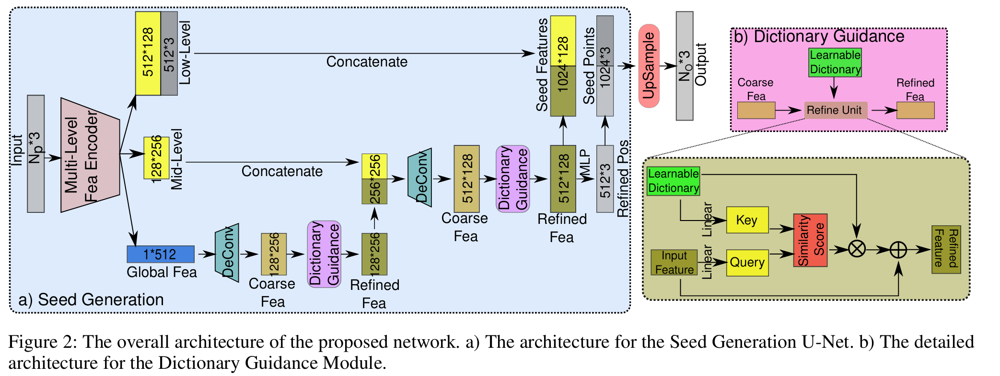

## Introduction

Point Cloud는 3D object를 표현하는 효율적인 data structure입니다. 이러한 장점에도 불구하고, 3D sensors로부터 얻어진 raw point cloud는 sparsity와 incompleteness를 가지고 있기에 자율주행과 같은 downstream task를 하는데에 어려움을 제공합니다. 따라서, missing region in point cloud를 reconstruction하는 task는 필수적입니다. 하지만, point cloud completion task는 매우 challenge합니다. missing portions에 대해 reconstruction를 잘 하기 위해서는 high-level semantic feature와 low-level spatial and geometirc relationship of nearby points 
understanding이 필요합니다. 거기에, point cloud completion task는 하나의 입력에 대해서 여러 정답이 나올 수 있는 ill-posed problem으로 정의됩니다.

대부분의 deep learning based point cloud completion task를 해결하는 방법들은 two stage의 encoder-decoder 와 upsampling network구조를 가지고 있습니다. Encoder-Decoder를 통해서 coarse seed point clouds를 생성하고, upsampling network를 거쳐 upsample 및 refine를 합니다.그러나, incomplete point cloud로부터 인코딩된 특징들은 missing part의 구체적 geometric한 정보를 담아내지 못합니다. 
제안방법 (ODGNet)는 위의 문제를 해결하며, point cloud completion task에서 좋은 성능을 보여줍니다. 특히, ODGNet는 Seed Generation U-Net과 Dictionary Guidance Module의 두가지 key component로 구성되어 있습니다. Seed Generation U-Net는 multi-level feature extraction, concatenation, utilikzation of local seed feature를 통해 seed points를 생성합니다. 동시에, Dictionary Guidance Module은 orthogonal shape prior를 학습함으로써 inference시에 더 좋은 shape를 만들어냅니다. 

## Method
**Overview**

제안방법은 incomplete point cloud가 입력으로 들어오게 되면 missing shape을 추론하여 complete point cloud를 생성합니다. 
저자들은 coarse seed point들을 생성 및 그러한 points를 target resolution으로 upsampling 하기위해서 Seed Generation U-Net 및 Upsample Transformer를 디자인하였습니다. 

**Seed Generation U-Net**

일반적으로 encoder내의 downsampliong operation은 fine details를 놓쳐서 decoding에서 recover를 어렵게 합니다. 저자들은 2D image processing technique중 하나인 U-Net의 기술로부터 영감을 받았습니다. 특히, multi-level feature 추출과 decoder의 output과의 concatenation통해 reconstruction에 있어서 fine한 정보를 유지할 수 있다는 점입니다. 또한, 제안방법에서는 seed point만 추출하는 것이 아니라, seed feature또한 도입함으로써 각 seed point 주변의 rich한 local 정보를 얻을 수 있도록 합니다. 

**Encoder**

제안 방법의 Encoder의 역할은 an incomplete point cloud로부터 multi-level shape feature들을 추출하는 것입니다. 이를 위해서, 다양한 해상도에서 local shape features의 추출과 points의 점진적 sub-sampling이 가능하게 하는 set abstraction module를 사용합니다.
과정은 다음과 같이 이루어집니다. input point coordinates와 해당 coordinates에서의 point feature를 set abstraction module과 point transformer에 입력하여 point coordinates와 point features를 출력합니다. 이러한 과정을 반복적으로 함으로써, multi-level에서의 point feature와 point coordinates를 추출할 수 있습니다.

**Decoder**

제안 방법의 Decoder의 역할은 complete seed point cloud를 생성하는것입니다. 저자들은 TopNet으로부터 영감을 받아서 feature space에서 seed points를 생성하는 비슷한 approach를 적용했습니다. 이 방법은 global shape code를 multiple child features로 점진적으로 분할함으로써 seed point 생성을 가능하게 합니다. 각 child feature는 missing part의 local shape를 capture하고 있고, 서로 다른 kernel size의 1D deconvolution를 적용하여 다양한 사이즈의 child feature를 만들 수 있습니다. 
그러나, 이러한 child feature는 오직 coarse shape 정보들을 표현하고 information loss를 가지고 있습니다. 이를 극복하기 위해서, 제안 방법은 Dictionary Guidance Module를 도입합니다. 이는 coarse child feature로부터 refined features를 생성하고 detailied geometry를 reconstruction하는데 중요한 역할을 합니다. 

**Dictionary Guidance Module**

Seed Generation 과정은 incomplete point cloud로부터 missing shpe information 추론하는 것이기에 추가적인 지식이나 가이던스 없이는 ambiguous shape를 만들 수 밖에 없다고 말합니다. 
이 문제를 해결하기 위해서, 저자들은 prior knowledge를 도입합니다. 그들의 아이디어는 ground-truth point cloud로부터 common shape features를 학습할 수 있다는 것입니다. 예를 들어, 학습하는 동안에 training set에서 airplane의 common features를 알게 되면, test phase에서 unseen airplane에 대해서 학습된 common feature를 strong prior로 사용할 수 있게 된다는 것입니다. 
이 아이디어를 deep learning에 녹이기 위해서, 제안 방법은 learning query (feature vector)를 사용합니다. 저자들은 learnable dictionary가 training samples로부터 shape prior를 배울 수 있도록 합니다. 또한, shape completion process의 smooth guidance를 위해서, Refine Unit를 적용하여 shpae priors를 coarse input feature에 intergrate되도록 합니다.

**Refine Unit**

learning dictionary로부터 추가적인 shape informtation를 사용하고, refined point features를 생성하는 것이 제안 방법의 주된 목표입니다. 특히, coare fatures에 대해 learning dictionary에서 비슷한 feature vectors를 찾아냅니다. 그리고, similar feature vectors와 coarse features를 합쳐서 missing details들을 보완합니다. 
이를 위해 다음과 과정을 거칩니다. 먼저, cross attention mechanism 빌려와서 두 feature vectors사이의 similarity score를 계산합니다. 그리고, 예측된 simliarity scores를 사용하여 dictionary내의 관련된 feature vectors를 합칩니다. 

**Orthogonal Constraint**

Learnable dictionary의 representation ability를 보장하기 위해서는 각 prior feature가 다른 features과 구별이 되어야만 합니다. 이를 위해서, 저자들은 각 prior feature가 다른 features과 orthogonal하도록 하는 Orthogonal Constraint를 제안합니다.

**Loss Function**

제안 방법은 Seed Generation과 Upsampling process를 학습하기위해서 Chamfer Distance Loss를 사용합니다. 먼저, Seed Generator에서 나온 Seed와 gt간의 Chamfer distance loss, Upsample Transformer로부터 나온 Upsampled Points와 gt간의 Chamfer distance loss, 마지막으로 Othogonal Constraint loss가 적용됩니다.
