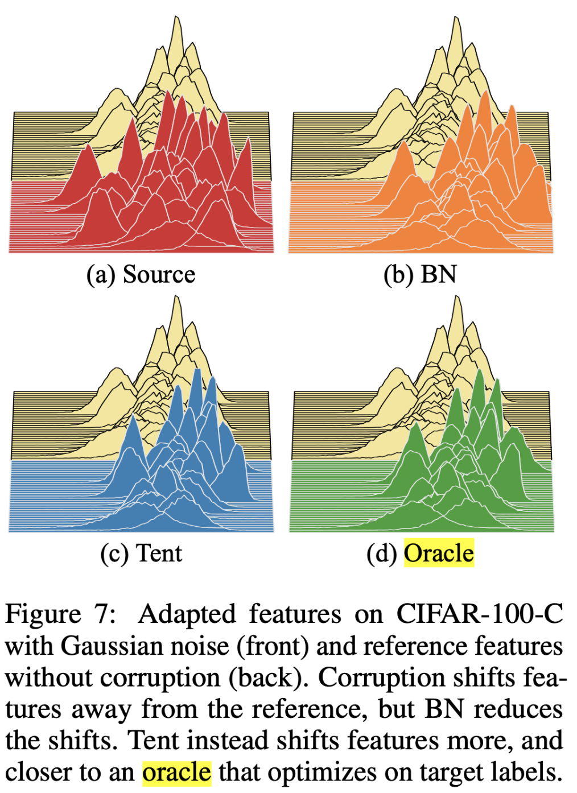

## Introduction
최근 Deep learning발전에 따라 downstream task인 classification, detection, segmentation 등 다양한 task에서 SOTA(State of the Art)를 찍어내고 있습니다. 이러한 발전에 따라 문제점 또한 제기되고 있습니다. 그중에서도, 학습 데이터와 테스트 데이터 간의 distribution이 다른 상황속에서는 deep learning의 성능이 저하되는 domain shift문제점이 잘 알려져있습니다. 실제로 산업에서 deep learning분야를 연구해보신 분들은 아시는것처럼, static한 environment에서는 deep learning은 저희 예상대로 잘 돌아가지만, 자율주행과 로봇과같은 분야에서는 environment가 계속 바뀌기 때문에 알고리즘이 잘못된 결과를 가져오게 됩니다.

위와 같은 domain shift 문제를 주로 다루는 연구 분야가 domain adaptation이고, 그 가운데 최근 핫한 분야가 Test-Time Adaptation 분야입니다. 그럼 어떤 차이가 있는지 알아봅시다. 아래의 표가 TENT라는 논문에서 설명하는 domain adaptaion과 test-time adaptation의 차이입니다. domain adaptation에서는 크게 souce, target(아래표에서 s, t)으로 데이터를 분류하고, source 학습 데이터, target은 test data 입니다. 주의할점은 "두 data간의 distribution이 다르다"라는 가정이 있습니다.

TTA의 가정은 크게 두가지입니다.
- No Access to Source Data 
- Availablility of Target Data(Unlabeled) and Parameters trained with source data

 

위 가정처럼, TTA 문제는 예를들어 privacy 문제로 인해 데이터에 대한 접근이 어려운 상황에서 source에 학습된 parameter들만 사용하여 target data에 적응시키는 것입니다.

## Method: TEST entropy minimization via feature modulation

본 논문에서 TTA를 해결하기 위해 'TENT'(Test Entropy)개념을 사용합니다. 골자는 test dataset에 대한 prediction를 얻어, entropy가 작아지도록 학습하는 것입니다. 학습을 위한 objective는 다음과 같습니다.

$$H(\hat{y})=-\sum_{c}p(\hat{y}) \ logp(\hat{y})$$

위의 식은 정보이론에 나오는 Entropy이고, 정보의 불확실도를 표현하고 있습니다. 위의 식을 그래프로 표현하면 다음과 같습니다. x축은 확률(model 예측), y축은 Entropy입니다. 모델의 예측이 불확실할수록 Entropy가 증가함을 알 수 있습니다.

 

위의 그래프처럼, 모델인 Entropy가 작아지는 방향으로 학습을 하면, 확률이 0이나 1에 치우치게 됩니다. 이를 통해 모델의 불확실도가 낮아진다고 보면 됩니다. 

본 논문에서는 test-time에서 model의 모든 parameter를 업데이트 하는것은 sensitive해지고 inefficient하다고 주장합니다. 그래서, 제안 방법은 feature modulation만 업데이트한다고 합니다. 여기서 feature modulation함은 normalization statistic와 transformation paramters뿐이라고 합니다. 실제 구현은 noramalizaion layer들만 업데이트하였다고 합니다. 

## Experiments

실험은 CIFAR-10/CIFAR-100에 오염이 포함된 데이터셋, ImageNet, MNIST/SVHN을 사용하여 Residual Networks (R-26 아키텍처)를 활용하여 수행되었습니다. 비교된 방법에는 "Only Source" (소스만 사용), "test-time normalization" (타겟 도메인의 배치 정규화 통계를 업데이트), "Pseudo-Labeling" (신뢰 임계값을 조절하고 pseudo 레이블을 할당)이 포함되었습니다.

Error 비교 결과(x축은 corruption에 사용된 augmentaion)
TENT는 일관적으로 모든 augmentation type에 대해서 robust하게 작동하는 모습을 보여줍니다.

 

## Analysis

아래는 각 method에 따른 feature distribution을 표현한 그림입니다. 본 method를 effectiveness를 표현하기에 가장 인상적인 anlaysis인 듯 합니다. 각 그림에서는 front는 adaptation을 한 후, back은 adaptation하기 전입니다. BN은 target dataset에 대해 Batch normalization만 업데이트한 방법, Oracle은 target label로 학습한 경우입니다. BN을 사용하여 reference feature에 가까워진 것을 알 수 있는 반면에 Tent는 reference feature와는 조금 다르지만 오히려 Oracle과 비슷한 feature 를 가지고 있다는 것을 알 수 있습니다. 이를 통해, Tent(test entropy) minimization를 적용하여 task specific한 feature를 representation할 수 있다는 것을 보여줍니다.

 

## Conclusion

본 논문은 TTA라는 새로운 problem setting을 제안하여 Real-World에 바로 적용가는 할 수 있는 실용적인 방법이라고 느껴졌습니다. 앞으로 딥러닝이라는 알고리즘이 어떻게 real-world에 접목을 시킬지가 중점이 되지 않을까 싶네요. 제 개인적인 견해입니다. 이 논문을 시발점으로 최근(2023년)에도 top-tier 학회에서 관련 논문들이 쏟아져나오고 있습니다. 관심있으신 분들은 읽어보시는 것을 추천드립니다!

## Reference
- Wang, Dequan, et al. "Tent: Fully test-time adaptation by entropy minimization." arXiv preprint arXiv:2006.10726 (2020).