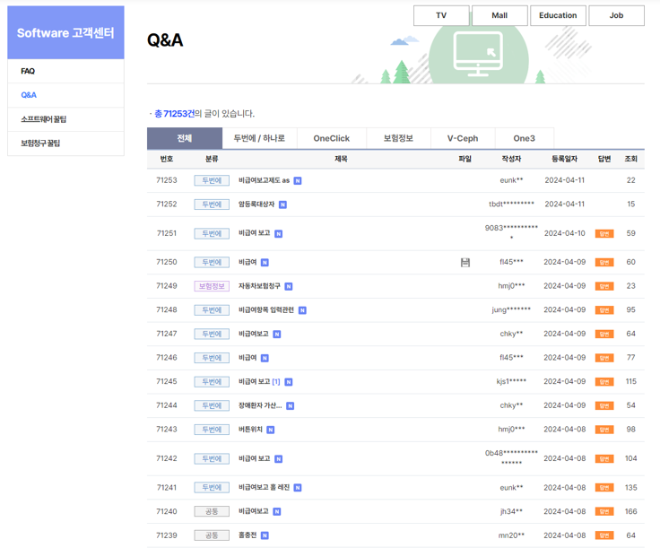
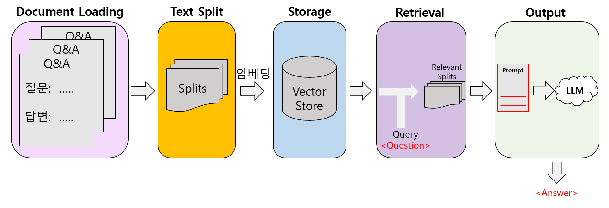
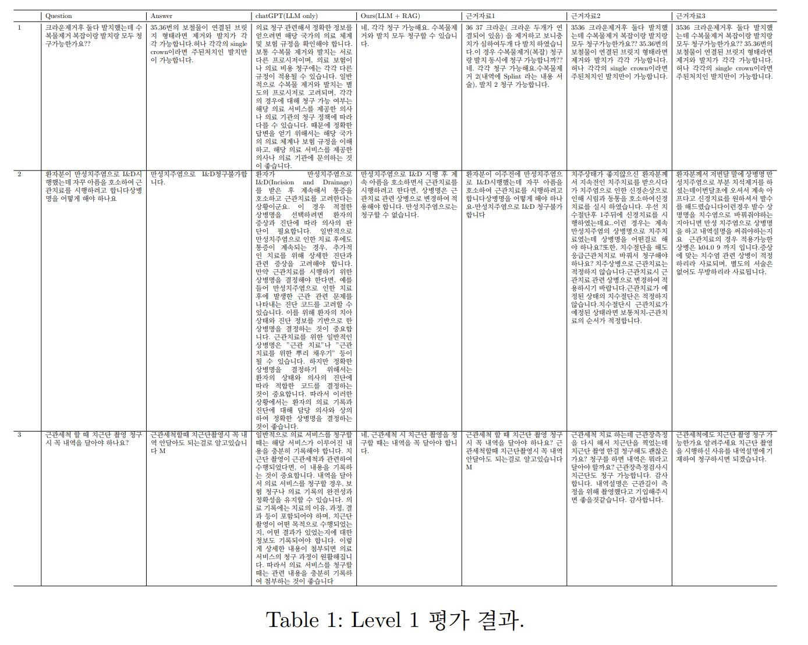

## Goal⛳️: RAG를 활용한 사내 웹사이트 챗봇 개발

## Motivation 📚

* 사이트내의 Q&A 질문들을 자동으로 답변하여 노동력 절감.
* 충분한 양의 데이터 보유 (Q&A 질문 건수: 약 70,000건).
* LLM 학습에는 많은 비용 (GPU 및 전력)이 요구되지만, RAG을 활용하게 되면 학습이 필요 없음.

## Data 🏦
</img> 

* 데이터 구성
  * 질문 번호
  * 질문 카테고리
  * 질문 제목 
  * 질문 내용
  * 답변 내용

* 데이터 전처리
  * 질문 혹은 답변의 길이가 매우 짧은 경우 사용 X.
  * 질문과 답변이 연속적으로 이루어지는 경우, 답변에 질문이 포함되어 해당 항목을 제거.

## Workflow 👓

* 검색기(Retrieval): 유저의 질문에 대해 가장 관련성이 있는 정보를 데이터 베이스 (Vector Store)내에서 찾아내는 역할.
* 생성기(LLM): 검색기에서 찾아진 정보를 바탕으로 유저의 질문에 대한 답변 생성 (Ex., ChatGPT, Llama2, 한국어 언어 모델)
* Embedding Model: Document(Context)를 벡터화하는 모델.

</img> 

## 실험 setup 🧪

아래처럼, 정성적인 평가를 위해서 자체적으로 3개의 level로 나누어서 평가.
* Level 1: 기존 질문(Context)에 대한 근거자료 일치도. (이를 통해 Vector의 quality와 검색기의 성능을 확인)
  * 평가 방법: Context에 사용된 질문과 동일한 질문을 하여 근거 자료에 해당 질문과 답변이 있는지 확인하여 Embedding 정확도를 정성적으로 확인.

* Level 2: 기존 질문(Context)와 비슷한 질문하기.
  * 평가 방법: 기존 질문과 문맥은 비슷한지만 말투나 질문 형식을 변형시켜 시스템의 민감도를 확인.

* Level 3: Context에 사용되지 않은 질문하기.
  * 평가 방법: Context에 사용되지 않은 새로운 질문을 함으로서 시스템의 작동 및 결과 확인.

## 실험 결과 👨‍🔬
### Level 1 실험 결과
</img> 

### Level 2 실험 결과

### Level 3 실험 결과
