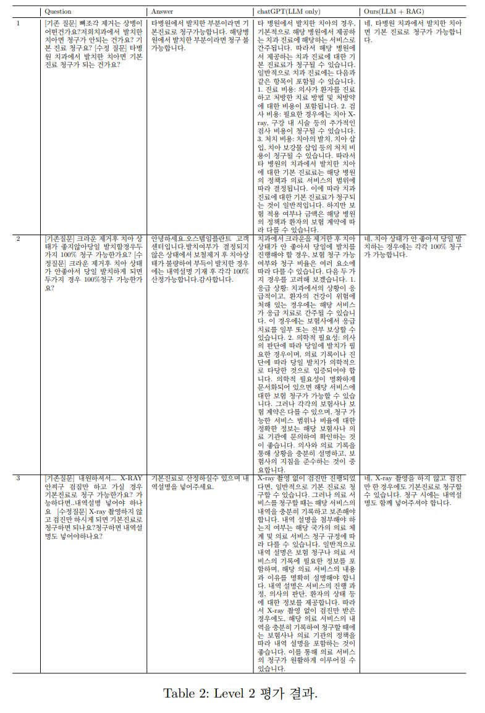
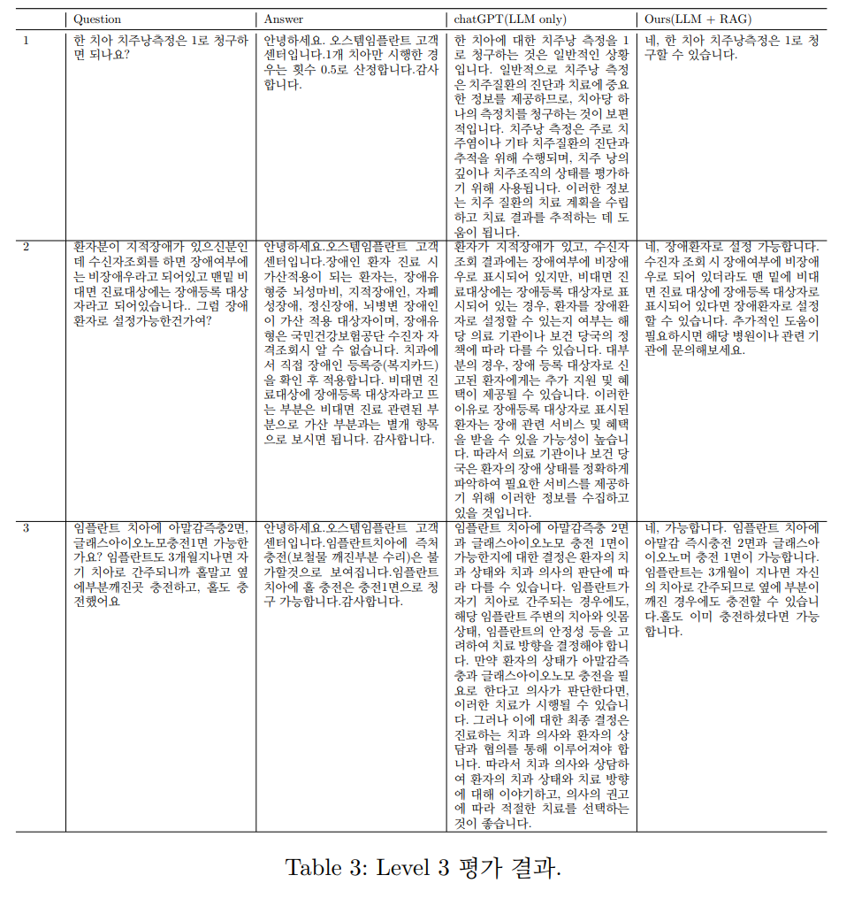

## Goal⛳️: Developing an In-house Website Chatbot Using RAG

## Motivation 📚

* Automate responses to Q&A questions on the site to reduce labor costs.
* Sufficient amount of data available (Number of Q&A entries: about 70,000).
* Training LLMs requires a lot of costs (GPU and power), but with RAG, no training is needed.

## Data 🏦
</img> 

* Data Composition
  * Question ID
  * Question Category
  * Question Title 
  * Question Content
  * Answer Content

* Data Preprocessing
  * Questions or answers that are too short are excluded.
  * If a question and answer sequence includes the question in the answer, that entry is removed.

## Workflow 👓

* Retriever: Responsible for finding the most relevant information in the database (Vector Store) based on the user's question.
* Generator (LLM): Generates an answer to the user's question based on the information retrieved (e.g., ChatGPT, Llama2, Korean language models).
* Embedding Model: A model that vectorizes the document (context).

</img> 

## Experiment setup 🧪

For qualitative evaluation, the system was divided into three levels, as follows:
* Level 1: Checking the consistency of evidence materials with the existing questions (Context). (This is used to verify the quality of the vectors and the performance of the retriever.)
  * Evaluation Method: Ask the same question used in the context to see if the evidence material includes the question and answer, qualitatively verifying the embedding accuracy.

* Level 2: Asking questions similar to the existing ones (Context).
  * Evaluation Method: Slightly modify the tone or format of the existing questions to check the system's sensitivity.

* Level 3: Asking questions not used in the context.
  * Evaluation Method: Test the system's operation and results by asking new questions not included in the context.

## Experiment Results 👨‍🔬
### Level 1 Experiment Results
</img> 

* When the same question was asked, the evidence materials included that question, indicating that vector retrieval is working well.

### Level 2 Experiment Results
</img> 

* In most test datasets, evidence materials with similar contexts to the existing questions were predicted.

### Level 3 Experiment Results
</img> 

* The system still struggles to generate accurate answers when asked new questions it has not encountered before.
