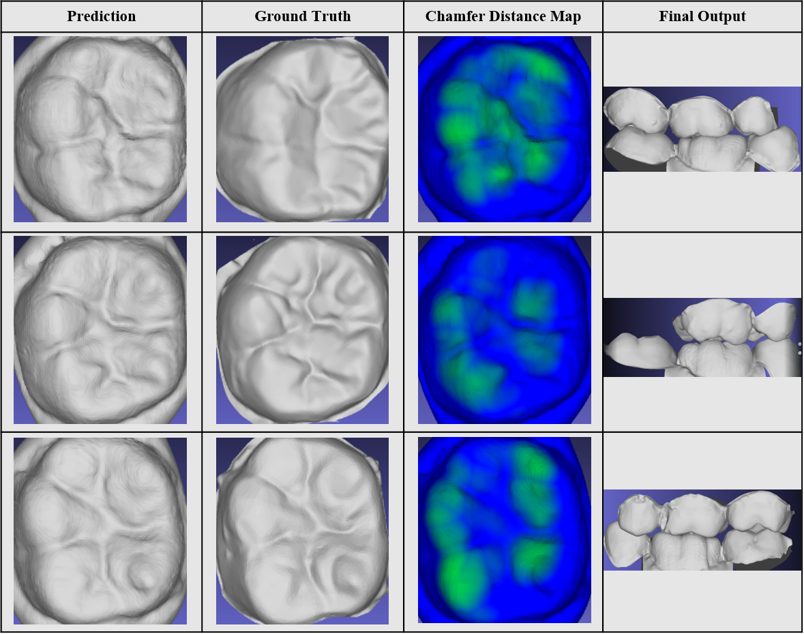

## Goal⛳️: 인접 치아 메쉬로부터 크라운 메쉬 생성
* 예측된 대상 치아는 인접 치아와의 충돌없이 교합이 잘 되는 것이 중요하기에, 인접 치아의 위치를 모델이 이해하는 것이 포인트.
* 환자의 크라운 디자인을 위해서는 Mesh로 출력하는 것이 요구사항이기에 Point Cloud간의 연결성을 학습하는 것이 중요.

## Motivation 📚
 * 치과에서 크라운을 치공소에 보내어 크라운 디자인을 하는 시간적, 인적 리소스 축소 및 자동화.
 * 다양한 메쉬를 생성함으로서 데이터 증강에 활용.

## Data 🏦

### 데이터 구성
* 형식: 메쉬
* 데이터 수: 700개
* 인접 치아와 대상 치아 쌍

### 데이터 전처리
* 모든 치아의 데이터셋간의 위치를 맞추기 위해서 Rigid ICP 활용.
* Segmentation를 통해 치아 번호 분할.
* 분할된 치아에 대해 각 치아별 인접 치아와 대상 치아로 쌍을 구성.

## Approach 💡
* PoinTr 모델을 활용하여 Point Completion 문제를 풀어, 인접 치아의 Global한 위치정보를 이해하도록 설계. 
* 추가로, MLP를 뒷단에 붙여서 Mesh Surface를 생성하기 위해서 Point Cloud로부터 Normal Vector를 예측하도록 설계.
* Normal Vector를 학습하기 위해서, Differentiable Poissong Surface Reconstruction를 활용하여 Poisson 방정식를 풀도록 설계.

## Workflow 👓
</img> 
1. 인접 치아 메쉬로부터 포인트 클라우트 추출.
2. PoinTr 모델을 활용하여 대상 치아에 대한 Point Cloud 생성.
3. Point Cloud로부터 MLP를 통과시켜 Point Cloud에 대한 offset 및 normal vector 예측.
4. Point Cloud와 Normal Vector로부터 Differentiable Poisson Surface Reconstruction를 하여 Surface 정보를 Grid화 (Prediction grid).
5. GT Mesh로부터 Point Cloud와 Normal vector를 샘플링하여 GT grid 생성.
6. GT point cloud와 Predcition Point cloud사이의 Chamfer Distance Loss로 학습 및 GT grid와 Prediction grid간의 MSE Loss로 학습.

### Differentiable Poisson Surface Reconstruction
포인트 클라우드와 법선 벡터로부터 implicit surface를 재구성하기위해 Poisson 방정식 푸는 접근 방식.
1. 포인트 클라우드과 법선 벡터를 그리드 형태로 변환
2. 레스터화된 데이터를 주파수 도메인으로 변환 (Fourier Transform)
3. 법선 벡터의 발산 (divergence) 계산
4. Laplacian 연산자 계산
5. Poisson 방정식 해 계산(주파수 도메인의 해)
6. Poisson 방정식의 해를 공간 도메인으로 변환
7. 3D grid 형태의 implicit surface field 반환 (표면 내부에서 양수, 외부에서 음수, 표면에서 0으로 표현)

## 실험 결과 👨‍🔬
</img> 
위 표는 모델이 생성한 치아 메쉬, 실제 치아 메쉬, 두 메쉬 간의 충돌 맵, 그리고 인접 치아들과 합쳐서 교합된 최종 결과를 보여줍니다.
실제 치아와의 치아 윗면을 비교해보았을 때, 치아 내의 굴곡과 교합이 상당히 잘 되어있는것으로 보입니다. 이는, PoinTr를 통해서 인접치아들과의 global localization 정보가 잘 반영되었고, 동시에 Differentiable Poisson Surface Reconstruction를 학습하여 Mesh의 local 특징인 표면이 잘 드러나보였습니다. 