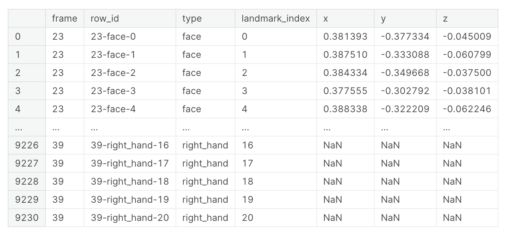

## Objective ⛳️
The goal of this competition is to classify isolated American Sign Language (ASL) signs. You will create a TensorFlow Lite model trained on labeled landmark data extracted using the MediaPipe Holistic Solution.

## Evaluation
The evaluation metric for this contest is simple classification accuracy.

### Challeges 🤔
- > In this competition we need to submit a TensorFlow Lite model file. Our model must also perform inference with less than 100 milliseconds of latency per video on average and use less than 40 MB of storage space. Expect to see approximately 40,000 videos in the test set. 

## Data 📝
### Description
The Isolated Sign Language Recognition corpus (version 1.0) is a collection of hand and facial landmarks generated by Mediapipe version 0.9.0.1 on ~100k videos of isolated signs performed by 21 Deaf signers from a 250-sign vocabulary.
Data format is time-series. 
### Structure

### Visulization
<video src="asl.mp4" width="320" height="240" controls></video>

### Observation from EDA
- In my observation, this asl-sign data was created from videos taken with one hand holding the camera.
- Empty frames in dataset.
- Every body part is not necessary.

### Preprocess
- We only use only one hand for training.

## My Approach 💡
- Transformer Architecture for time-series data
- Data Augmentation(Masking,Rotation,Flip)
- Self-Supervised Method (pretraining) - Masked Auto Encoder
- Ensemble
- Change Dropout Rate during training for moodel generalization
- Optuna for hyper-parameter tunnings
- Stochastic Weight Averaging for model generalizaiton 

## Competition Results 🥈 
We achieved silver medal from this competition. This is [leaderboard](https://www.kaggle.com/competitions/asl-signs/leaderboard).By using generalization techniques such as self-supervised method, ensemble, stochastic weight averaging, our model showed better score on private data. 

