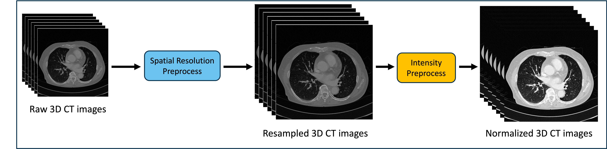

## Objective ⛳️
Development of a solution for early detection and analysis of nodules that can develop into lung cancer from lung CT scan information of patients.

## Data 📝
### Description
- About 1,000 scans from anonymous hospitals in the United States, Korea, and Japan (Private dataset)
- LUNA16 (Public dataset)
### Preprocess

The preprocessing is performed as shown in the figure above.
1. Since the spacing resolutions of individual raw 3D CT images are different, all CT images are resampled to the target spacing. (Spatial Resolution Preprocessing)
2. The resampled CT images are windowed and normalized from the Hounsfield Unit (HU) value. (Intensity Preprocessing)
### Annotation
- Nodule coordinates and size (x, y, z, d)
- Consensus score (number of radiologists who agree out of 4)
### Challeges 🤔
- **The ambiguity of the criteria for defining a nodule among radiologists.**
- **The location of nodules is annotated in 3D CT, but information about non-nodules is insufficient.**
- **Nodules are relatively small and rare compared to the size of a 3D CT volume.**

## Method 💡

The figure above shows a module for detecting lung nodules. The module consists of two stages. First, it detects candidates that are suspected to be nodules from CT scans. Then, it classifies the nodules by scoring the probability of being nodules from the detected nodules through the scoring network.

### Detection Nodule Candidates (1 stage)
1. The problem is viewed from the scan level to the patch level by applying the sliding window method to the pre-processed 3D CT images.
2. During training, patches that contain annotated nodules are used to train the detection network.
3. Since the volume size of the nodule varies greatly, 3D modeling is performed considering multi-scale features. 
    - Network composition: backbone, neck, head (Similar to CenterNet)
    - Input: 3D patch, 3D heatmap
    - Output: Output heatmap
    - Consensus information is reflected in the loss function.
4. Duplicate predictions are removed through volumetric NMS.
5. Evaluation and Analysis 
6. Optimization and encryption through torchscipt
7. Deploy 

### Candidate Scoring Network (2 stage)
1. Utilize the nodule candidate patch from the detector as inputs.
2. Generates negative nodule patches for training.
3. Uses test-time augmentation (TTA) to improve the recall for small nodules.
4. Evaluation and Analysis 
5. Optimization and encryption through torchscipt
6. Deploy 